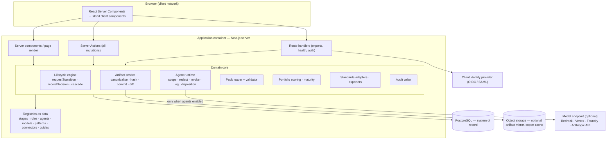
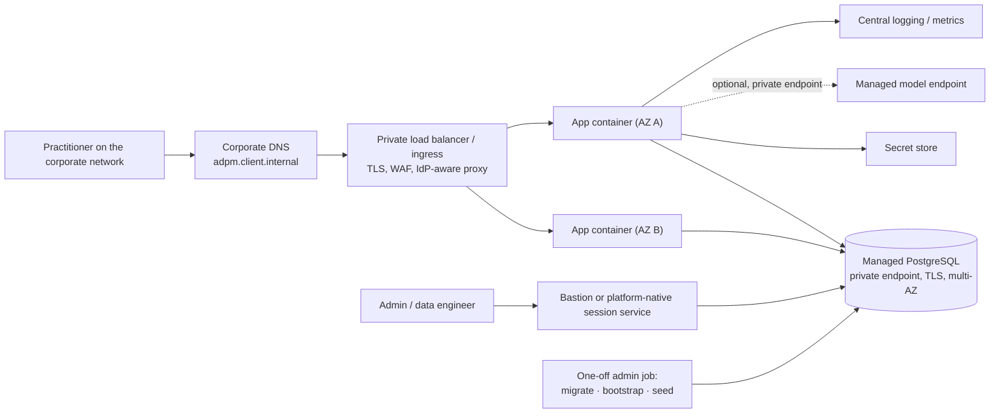

# 02 — Solution architecture

How the application is constructed, how a request flows through it, and how it sits inside a client
network. Cloud-specific detail is in documents [05](05-cloud-aws.md), [06](06-cloud-azure.md) and
[07](07-cloud-gcp.md); everything here is true on all three.

---

## 1. Technology stack

| Layer | Choice | Why it is the choice |
|---|---|---|
| Framework | **Next.js 15**, App Router, React Server Components, Server Actions | One deployable unit, server-rendered by default, mutations that cannot be called without going through server code |
| Language | **TypeScript strict**, React 19 | No `any`; no `@ts-expect-error` without a named upstream issue |
| UI | **Tailwind CSS**, shadcn/ui primitives, lucide-react | Small, accessible primitive set; no component framework lock-in |
| Validation | **Zod** | One schema per artifact type, shared by the server action and the form. Also validates enums, packs, imports and agent output |
| ORM | **Prisma** | Type-safe access, one schema, generated migrations |
| Database | **PostgreSQL 16** managed (SQLite only for local development) | Per-cloud mapping in §7 |
| Auth | **Auth.js v5**, JWT session | Stateless sessions; replace the credentials provider with OIDC for client deployments (§5) |
| Forms / data | react-hook-form, @tanstack/react-query | |
| Diagrams | **Mermaid**, rendered client-side from generated source | ER, lineage, flow and dependency diagrams are generated from committed artifacts, never hand-drawn |
| Exports | docx, exceljs, pdf-lib, yaml | |
| Tests | **Vitest** (unit/integration) + **Playwright** (e2e) | |
| Package manager | **pnpm** | |
| Runtime | **Node 22 LTS** | |

**Non-negotiable stack rules.** Server Actions for mutations; route handlers only for exports,
streaming agent output and webhooks. Every mutation follows the same order: authenticate →
authorise by role → validate with Zod → transact → emit `AuditEvent`. Registries are data, never
code branches. No abstraction until there is a second concrete use case.

---

## 2. Logical architecture



**Everything is one process.** There is no separate API tier, no queue, no worker fleet and no
microservice split. That is a deliberate design decision for an application whose write volume is
human decisions: the complexity of a distributed design would buy nothing and would make invariant 2
(one approval path) harder to guarantee. Scale horizontally by running more identical containers.

The only asynchronous work is (a) agent invocation, which is request-scoped and bounded, and (b) the
optional scheduled monitoring job, which runs as a separate one-off task (§8.3).

---

## 3. Request path and transaction discipline

### 3.1 A page render

1. Middleware/session resolves the JWT; unauthenticated requests redirect to sign-in.
2. `requireSession()` loads user id, active workspace (from a cookie) and role keys for that
   workspace, server-side.
3. The server component queries Prisma with **every query scoped by `workspaceId`** and renders.
4. No client component ever receives a row the user is not entitled to see. Client-side filtering is
   never the control (invariant 10).

### 3.2 A mutation

Server Action, in this exact order — no exceptions:

```
authenticate → authorise by role (server-side) → validate input with Zod
  → prisma.$transaction([ … domain writes … ])
  → emit AuditEvent
  → revalidate the affected paths
```

The transaction boundary matters for three flows in particular:

- **Commit artifact:** version insert + provenance rows + cascade invalidation of dependent gates +
  re-approval tasks must be one transaction. The workspace mirror write happens *after* commit and
  must never fail the commit (**[GAP]** B3 in [hosting-prerequisites.md](../hosting-prerequisites.md)).
- **Record decision:** approval insert + quorum/veto evaluation + gate state change + stage advance +
  gate evidence pinning + publication must be one transaction. This is the only path that may write
  `Gate.state = APPROVED` (invariant 2).
- **Disposition proposal:** proposal state + artifact field value + provenance + agent action
  disposition must be one transaction, or provenance and content will disagree (invariant 5).

### 3.3 Idempotency and concurrency

- Committing content identical to the current version is a no-op, not a new version.
- Approvals are unique per `(gateId, userId, roleKey)`; a repeated submit updates nothing.
- Optimistic concurrency on gates: re-read gate state inside the transaction and fail the action if
  it is no longer `OPEN`.
- Workspace agent spend is a read-modify-write and can overshoot the cap under concurrency
  (**[GAP]** C5). For a client deployment either accept the overshoot with a stated tolerance, or
  make the increment atomic and enforce the cap with a `CHECK`-style guarded update.

---

## 4. Client-network topology

Ask these questions before designing anything. Several answers change the architecture.

| # | Question | If the answer is… |
|---|---|---|
| N1 | Is the application reachable from the public internet, or private-only? | Private-only removes public ingress, WAF and public certificates; it makes the IdP integration and admin access harder, not easier |
| N2 | Which identity provider, and can it issue OIDC to a new application? | If not, an identity-aware proxy in front is the only acceptable answer (§5.2) |
| N3 | Is outbound internet egress permitted at all? | If no, agents must run in local-heuristic mode or against an in-region managed model endpoint reached over a private endpoint (08 §6) |
| N4 | What is the data residency requirement? | Constrains region and model choice |
| N5 | Who administers the database, and does the client mandate a specific managed service or a self-managed cluster? | May override the per-cloud choices in §7 |
| N6 | Is there a mandated container registry, image scanning gate or golden base image? | Changes the build pipeline (§8) |
| N7 | Is TLS terminated at a corporate reverse proxy or load balancer, and does it inject headers? | Auth.js needs `AUTH_TRUST_HOST=true` and correct forwarded headers |
| N8 | What is the client's DNS and certificate process, and its lead time? | Usually the longest pole in the plan |

### 4.1 Target topology (all three clouds)



Rules that hold on every cloud:

1. **No public ingress to the container.** Ingress is the load balancer or the platform's managed
   ingress only, in private subnets or with public access disabled.
2. **The database has no public endpoint.** Private link/endpoint or VPC-internal only, TLS required,
   client certificate verification where the platform supports it.
3. **Two availability zones minimum** for the database. The app tier can be a single instance for a
   pilot; say so explicitly rather than implying resilience it does not have.
4. **Migrations and seeding run as one-off administrative jobs**, never from the web container. The
   seed can delete every table; nothing that destructive should be one HTTP handler away from a user.
5. **Egress is default-deny.** The only egress the application needs is the model endpoint, and only
   when agents are enabled. Everything else — package installs, image pulls — happens in the build
   pipeline, not at runtime.
6. **Secrets are injected from the platform secret store at start**, never baked into the image and
   never written to disk by the application.

---

## 5. Identity and access

### 5.1 What ships today, and why it is not enough

The reference implementation authenticates with an Auth.js credentials provider against
`User.passwordHash`, seeded with a published demo password. There is **no signup, invitation,
password change, password reset or deactivation** (**[GAP]** B1). This is acceptable for a laptop
demo and unacceptable for anything a client can reach.

### 5.2 Two acceptable answers

| Option | What it is | When to choose it | Effort |
|---|---|---|---|
| **A — Identity-aware proxy** | The platform authenticates before the request reaches the app; the app trusts a signed header for identity | Fastest route to a safe pilot; the client's IdP is already integrated with the platform | Low. Azure Easy Auth and GCP IAP are genuinely good at this; AWS needs ALB OIDC or Cognito |
| **B — OIDC in the application** | Replace the credentials provider with an Auth.js OIDC provider against the client IdP | The long-term answer; needed for role mapping from IdP groups and for non-browser clients | Medium — provider config, claim mapping, just-in-time user provisioning, deactivation on removal |

Do **not** ship option C ("keep credentials, change the passwords"). It has no deactivation path, no
rotation and no audit of authentication, and it will be the first finding in any client security
review.

### 5.3 Just-in-time user provisioning (needed by both options)

On first authenticated request for an unknown subject: create the `User` row from the IdP claims
(email, name, title), assign roles from group mapping, write an audit event. On a subject whose IdP
groups no longer include any ADPM group: set `archivedAt` and refuse the session. Never delete.

### 5.4 Role mapping

Configuration, not code — a JSON/YAML map from IdP group to `(workspaceSlug, roleKey, domainKey?)`,
loaded at boot and re-readable without a deploy. Ship an admin screen that shows the resolved
mapping and the roles each signed-in user actually holds; role questions are the most common support
call in governance tooling.

### 5.5 Authorisation

Server-side on every mutation, resolved from `RoleAssignment` for the active workspace, expressed as
`assertRole(userId, workspaceId, [allowedRoles])`. Approval rights are read from the **stage
registry**, never from the role table, so the RACI shown to users is the RACI the engine enforces.

### 5.6 Workspace scoping (multi-tenancy)

Single database, single schema, `workspaceId` on every tenant-scoped table. Every query filters by
the session's active workspace. Two additional controls are strongly recommended for a client
deployment:

- A repository-layer guard that fails any query built without a `workspaceId` predicate on a
  tenant-scoped table (a test, plus a code-review rule).
- PostgreSQL row-level security as defence in depth if the client mandates it — feasible because
  every tenant table carries `workspaceId`, but it requires setting a session GUC per connection and
  interacts with connection pooling. Treat as optional hardening, not the primary control.

---

## 6. Security model

| Control | Requirement |
|---|---|
| **Transport** | TLS 1.2+ everywhere, including app→database. HSTS at the edge. Session cookies `Secure`, `HttpOnly`, `SameSite=Lax` |
| **Session** | JWT, signed with `AUTH_SECRET` from the secret store, stable across deploys (rotating it invalidates every session). Lifetime 8 hours, idle timeout 60 minutes |
| **Secrets** | Platform secret store only. Never in the image, never in the repository, never in the database. The application must not persist API keys to disk in a hosted deployment (**[GAP]** B4 — use the environment variable path) |
| **Encryption at rest** | Platform-managed keys minimum; customer-managed keys where the client requires it — supported by all three managed database services |
| **PII** | The application stores what practitioners type. Attribute registers mark personal-data attributes explicitly; access policies and regulatory maps are first-class artifacts. Agent context is redacted before it leaves the process (08 §4) |
| **Input validation** | Zod at every boundary — form, server action, route handler, pack loader, metadata import, agent output. Reject, never coerce |
| **Output encoding** | React escapes by default. The only `dangerouslySetInnerHTML` is Mermaid SVG rendered with `securityLevel: 'strict'`; keep it that way |
| **File upload** | CSV profiling extracts and metadata exports are parsed in-process with size and row caps, never executed, never stored raw beyond the import row |
| **Audit** | Every mutation emits an `AuditEvent` with actor, action, entity and payload. Append-only. This is governance evidence, not application logging — keep it in the database, not only in the log platform |
| **Dependency supply chain** | Lockfile-pinned installs, image scanning in the pipeline, no runtime package installation |
| **Rate limiting** | At the edge. The expensive endpoints are agent invocation and exports; cap both per user |
| **Threat model highlights** | Privilege escalation via client-side role assumption (mitigated: server-side authorisation); gate approval bypass (mitigated: single write path + test); prompt injection through imported metadata or artifact text (mitigated: scope, redaction, human disposition, and the fact that agent output can never act — 08 §5) |

---

## 7. Database: the per-hyperscaler mapping

PostgreSQL on all three. SQLite is the local development store only and will not work on any
platform (ephemeral container storage loses it; a persistent disk makes the instance a pet).

| | AWS | Azure | GCP |
|---|---|---|---|
| **Primary choice** | Aurora PostgreSQL Serverless v2 | Azure Database for PostgreSQL — Flexible Server | Cloud SQL for PostgreSQL |
| **Alternative** | RDS for PostgreSQL (simpler, cheaper at steady small scale) | — | AlloyDB for PostgreSQL (heavier; only if the client already standardises on it) |
| **Version** | 16 | 16 | 16 |
| **Pilot sizing** | Serverless v2, 0.5–2 ACU | B2s / D2ds v5, 32–64 GB | db-custom-2-7680, 50 GB SSD |
| **Production sizing** | 1–4 ACU, Multi-AZ | D2ds/D4ds v5, zone-redundant HA | db-custom-4-15360, HA regional |
| **Private access** | Private subnets + security group; no public accessibility | Private access (VNet integration) or private endpoint | Private IP + Private Service Connect |
| **Connection management** | RDS Proxy if instance count > 4 | Built-in PgBouncer on Flexible Server | Cloud SQL Auth Proxy / connector; PgBouncer sidecar if needed |
| **Managed identity auth** | IAM database authentication | Entra ID authentication | IAM database authentication |
| **Backup** | Automated, PITR, 7–35 days | Automated, PITR, 7–35 days | Automated, PITR, 7–35 days |
| **Encryption** | KMS, CMK supported | CMK supported | CMEK supported |

Connection-pool sizing is the one number people get wrong: Prisma opens a pool **per container
instance**. Set `connection_limit` explicitly in `DATABASE_URL` and size it as
`instances × connection_limit + headroom for admin jobs ≤ max_connections`. Start with
`connection_limit=5` and a hard cap on instance count (**[GAP]** C6). Cloud Run and Container Apps
scale aggressively by default and will exhaust a small instance's connections long before CPU.

---

## 8. Build, deploy and operate

### 8.1 Container

One image, identical across clouds: Node 22 Alpine, multi-stage build, Next.js `output: 'standalone'`,
non-root user, `PORT` honoured from the environment, Prisma client generated against the Postgres
schema at build time. Full Dockerfile in
[hosting-prerequisites.md §5](../hosting-prerequisites.md) (**[GAP]** B5).

### 8.2 Pipeline

```
lint → typecheck → unit + integration tests → build image → scan image → push to registry
  → deploy to non-production → run migrations as a job → e2e tests → manual approval → production
```

Gates that must not be optional: `pnpm typecheck`, `pnpm lint`, `pnpm test`, `pnpm build`, image
scan, and the invariant test suite (09 §4). Database migrations run as a **separate job** before the
new revision takes traffic, and must be backwards compatible with the previous revision for the
duration of the rollout.

### 8.3 Runtime configuration

| Variable | Required | Notes |
|---|---|---|
| `DATABASE_URL` | yes | From the secret store; include `connection_limit` and `sslmode=require` |
| `AUTH_SECRET` | yes | From the secret store; stable across deploys |
| `AUTH_TRUST_HOST` | yes | `true` behind any proxy or load balancer |
| `PORT` | platform | Honour what the platform injects |
| `ADPM_WORKSPACE_DIR` | recommended | Writable persistent path, or `off` (**[GAP]** B3) |
| `ANTHROPIC_API_KEY` / cloud model credentials | optional | Only when agents run against a real model. Prefer platform identity over a static key (08 §6) |
| `ADPM_MONITOR_USER` | optional | Email of the human accountable for the scheduled monitoring job |

Scheduled monitoring (L3 agents over published products) runs as a platform scheduler → one-off job,
not as an in-process timer: ECS Scheduled Task, Container Apps Job, or Cloud Run Job. It writes
agent actions and findings like any other invocation and approves nothing.

### 8.4 Observability

| Signal | What to capture | Where |
|---|---|---|
| **Application logs** | Structured JSON: request id, user id, workspace id, action, duration, outcome. Never artifact content, never PII | Platform log service |
| **Metrics** | Request rate/latency/error by route; gate decisions per hour; artifact commits; agent invocations, tokens, cost; database connections in use; job success | Platform metrics |
| **Traces** | Optional. OpenTelemetry if the client already runs a collector |
| **Alerts** | 5xx rate > 1% for 5 min; p95 latency > 2 s for 10 min; DB connections > 80% of max; agent spend > 80% of workspace budget; migration job failure; backup failure |
| **Governance evidence** | Gate decisions, approvals, artifact versions, agent actions — **in the database**, exported through the audit and evidence-pack exports. Platform logs are for process health, not governance |

### 8.5 Backup, restore and DR

- Automated database backups with PITR; retention per the client's policy, minimum 14 days.
- **Test the restore.** A backup that has never been restored is a hypothesis. Restore to a scratch
  instance quarterly and run the reconciliation queries in [04 §8](04-data-loading.md).
- The artifact mirror and any export cache need no backup — both are derived from the database.
- DR: redeploy the image into the secondary region from the registry, restore the database from
  backup, repoint DNS. RTO 4 hours assumes the image and IaC already exist in the secondary region.

---

## 9. Environments

| Environment | Purpose | Data | Agents |
|---|---|---|---|
| **Local** | Development | SQLite, full demo seed | Local heuristic |
| **Development** | Integration, shared | Managed Postgres, demo seed, refreshed freely | Local heuristic |
| **Staging/UAT** | Client acceptance, training | Managed Postgres, one bootstrapped client workspace + demo workspaces | Real model, small budget |
| **Production** | The engagement | Managed Postgres, bootstrapped client workspaces only, **no demo accounts** | Real model, budgeted per workspace |

The demo seed must never run against staging or production after bootstrap: it opens with
`deleteMany()` across every table (**[GAP]** C2). Enforce this with a guard on the seed entry point
that refuses to run when `NODE_ENV=production` or when the target database already contains a
workspace not created by the seed.
