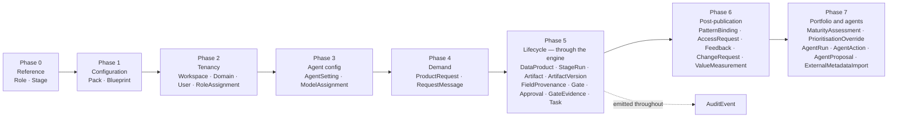

# 04 — Data loading specification

What goes into every one of the 35 tables: where it comes from, who may write it, in what order,
how much of it there is, and how to prove it landed correctly.

This is the data engineer's primary document. Read [03](03-data-model.md) first for the shape of the
model; this one is about its contents.

---

## 1. The rule that governs everything below

> **Reference and configuration data may be inserted directly. Lifecycle data may not.**

Eight tables — `Role`, `Stage`, `Pack`, `Blueprint`, `Workspace`, `Domain`, `User`, `RoleAssignment`,
plus `AgentSetting` and `ModelAssignment` — are configuration. A script may insert them.

Everything else records something that *happened*: a request submitted, an artifact committed, a
gate approved, an agent invoked. Those rows must be created by the application's own services, for
three reasons that are not negotiable:

1. **Invariant 2.** `Gate.state = 'APPROVED'` has exactly one legitimate writer, `recordDecision()`.
   A SQL `UPDATE` that sets it produces a database that lies about its own governance.
2. **Derived state.** Approving a gate also advances `DataProduct.currentStage`, writes
   `GateEvidence` rows pinning content hashes, closes the stage run, raises tasks and emits an audit
   event. A direct insert produces a row without its consequences.
3. **Content hashing.** `ArtifactVersion.contentHash` must be the canonical hash of the content.
   Insert one by hand and cascade invalidation (invariant 4) silently stops working for that
   artifact.

The reference seed obeys this rule: it drives all 73 demo products through the **real**
`requestTransition()` and `recordDecision()` calls the UI makes. If the engine is broken, the seed
fails — which is the point. **[BUILT]** `prisma/seed.ts`

**Consequence for the build:** the data engineer's tooling is not a SQL loader. It is a set of
Node/TypeScript scripts that call the same service functions the application calls. Budget for that.

---

## 2. Load phases



| Phase | Tables | Method | Idempotent? |
|---|---|---|---|
| 0 Reference | `Role`, `Stage` | Upsert from the code registries | Yes — upsert by key |
| 1 Configuration | `Pack`, `Blueprint` | Pack loader, validated YAML | Yes — upsert by pack key |
| 2 Tenancy | `Workspace`, `Domain`, `User`, `RoleAssignment` | Bootstrap script (§6) or IdP JIT provisioning | Yes — upsert by natural key |
| 3 Agent config | `AgentSetting`, `ModelAssignment` | Bootstrap script; then Admin UI | Yes |
| 4 Demand | `ProductRequest`, `RequestMessage` | Intake wizard, or a migration script calling the intake service | No — each submission is an event |
| 5 Lifecycle | 9 tables | **Engine only** — `commitArtifact`, `requestTransition`, `recordDecision` | No |
| 6 Post-publication | 5 tables | Application services | No |
| 7 Portfolio and agents | 6 tables | Application services / agent runtime | No |
| — | `AuditEvent` | Emitted by every mutation. Never written directly | No |

---

## 3. How to read the per-table entries

Each entry states: **Purpose · Phase · Written by · Source of truth · Mandatory columns · Example ·
Volume · Rules · Validation**. "Written by" is the only legitimate writer; anything else writing that
table is a defect.

Column names use the physical names in [`ddl/postgres-schema.sql`](ddl/postgres-schema.sql).
Seeded-row counts are from the reference demo (9 workspaces, 73 products).

---

## 4. Per-table specification

### 4.1 Tenancy and people

#### `Role` — phase 0
- **Purpose.** The catalogue of the eleven roles, so assignments can be foreign-keyed and inspected.
- **Written by.** Bootstrap/seed only, from `src/lib/domain/roles.ts`. Not user-editable.
- **Source of truth.** The code registry, always. The table is a projection.
- **Mandatory.** `id` (= role key), `key`, `name`, `door`, `owns`, `description`, `sortOrder`.
- **Example.** `('DATA_STEWARD','DATA_STEWARD','Data Steward','PRACTITIONER','Attribute definitions, classification, quality rules, glossary','Owns what each attribute means…',30)`
- **Volume.** Exactly 11 rows, forever.
- **Rules.** `door` ∈ CONSUMER, PRACTITIONER, LEADERSHIP, ADMIN. Adding a role is a code change plus
  a re-upsert; removing one is a migration with a plan for its existing assignments.
- **Validate.** `SELECT count(*) FROM "Role";` → 11.

#### `Stage` — phase 0
- **Purpose.** A projection of the twelve-stage registry so stage numbers are referenceable in SQL.
- **Written by.** Bootstrap/seed only, from `src/lib/lifecycle/stages.ts`.
- **Mandatory.** `number` (PK, 1–12), `key`, `name`, `purpose`.
- **Volume.** Exactly 12 rows.
- **Rules.** Approver roles, quorum, veto and exit criteria are **not** stored here — they live in
  the code registry so the engine and the RACI shown to users cannot disagree. Do not add them.
- **Validate.** `SELECT count(*) FROM "Stage";` → 12, and `number` is a contiguous 1–12.

#### `Workspace` — phase 2
- **Purpose.** One tenant: a client organisation, a business unit, a pilot or a demo.
- **Written by.** Bootstrap script; then Admin UI for settings.
- **Source.** Client engagement definition. One workspace per governance boundary — a workspace is
  where role assignments, budgets, metric-name uniqueness and prioritisation are scoped.
- **Mandatory.** `id`, `slug` (unique, URL-safe), `name`, `packKey`.
- **Defaults to confirm with the client.** `triageSlaHours` 48 · `agentsEnabled` false ·
  `agentsMaySeeSampleData` false · `agentBudgetUsd` 25 · `prioritisationModel` `WSJF_REUSE`.
- **Example.** `('ws_…','retail-emea','Retail EMEA','retail-cpg',72,true,false,250,0,'WSJF_REUSE')`
- **Volume.** 9 seeded. Client: 1–10.
- **Rules.** `packKey` must reference an installed pack. `agentsMaySeeSampleData = true` is a
  documented client decision, not a default (03 §8). `agentSpendUsd` is maintained by the runtime —
  never set it by hand except to reset a budget cycle, with an audit note.
- **Validate.** every `Workspace.packKey` exists in `Pack.key`.

#### `Domain` — phase 2
- **Purpose.** A business area inside a workspace — Claims, Network Operations, Supply Chain.
- **Written by.** Bootstrap script, from the pack's `domains` list or the client's own structure.
- **Source.** The client's actual data-domain map. If they do not have one, the pack's list is a
  starting proposal, not an answer.
- **Mandatory.** `id`, `workspaceId`, `key` (unique per workspace), `name`.
- **Volume.** 71 seeded (~8 per workspace). Client: 6–20 per workspace.
- **Rules.** Every product and request belongs to a domain; role assignments may be scoped to one.
  Renaming is fine; changing `key` breaks pack references — archive and create instead.
- **Validate.** no `DataProduct` or `ProductRequest` references a `domainId` outside its own workspace.

#### `User` — phase 2 (then continuous)
- **Purpose.** A person who signs in. Every decision in the system is attributable to one.
- **Written by.** Bootstrap script for the initial set; thereafter **JIT provisioning from the IdP**
  (02 §5.3). **[GAP]** B1 — no self-service user management exists.
- **Source.** The client's identity provider. Never a spreadsheet, after bootstrap.
- **Mandatory.** `id`, `email` (unique), `name`, `passwordHash`.
- **Example.** `('usr_…','priya.raman@client.example','Priya Raman','Data Steward, Retail','$2b$10$…')`
- **Volume.** 12 seeded. Client: tens to low hundreds.
- **Rules.** With OIDC, `passwordHash` becomes unused — set it to a random unusable value at
  provisioning and plan to drop the column (03 §8). Deactivation sets `archivedAt`; the row is never
  deleted, because approvals point at it. **Delete every seeded `@adpm.local` account before a
  client-facing environment goes live.**
- **Validate.** `SELECT count(*) FROM "User" WHERE email LIKE '%@adpm.local';` → 0 in production.

#### `RoleAssignment` — phase 2 (then continuous)
- **Purpose.** Grants one user one role in one workspace, optionally narrowed to one domain.
- **Written by.** Bootstrap script; then IdP group mapping (02 §5.4) or Admin UI.
- **Mandatory.** `id`, `userId`, `roleId`, `workspaceId`. `domainId` optional.
- **Volume.** 108 seeded (every role × every workspace). Client: users × workspaces × roles held.
- **Rules.** This table is the *only* source of authorisation — never the session claim alone.
  Every workspace needs at least one holder of each approver role of every stage it will run, or
  products stall at a gate nobody can approve. Check this at bootstrap, not at Stage 9.
- **Validate.**
  ```sql
  -- Every workspace can approve every stage: expect zero rows.
  SELECT w.slug, r.key FROM "Workspace" w CROSS JOIN "Role" r
  WHERE r.key IN ('DOMAIN_PRODUCT_OWNER','DOMAIN_SME','DATA_STEWARD','DATA_ARCHITECT',
                  'DATA_ENGINEER','SEMANTIC_STEWARD','PRIVACY_SECURITY_OFFICER','GOVERNANCE_COUNCIL')
    AND NOT EXISTS (SELECT 1 FROM "RoleAssignment" ra
                    WHERE ra."workspaceId" = w.id AND ra."roleId" = r.key);
  ```

### 4.2 Configuration

#### `Pack` — phase 1
- **Purpose.** An installed industry pack: domains, conformed backbone, canonical entities, controls,
  starter metrics, sample decisions, platform profiles, glossary, seed products.
- **Written by.** Pack loader (`loadPackFile` → validator → insert). Admin UI can reinstall.
- **Source.** `packs/*.yaml`. Nine ship; a client engagement usually authors one (§5).
- **Mandatory.** `id`, `key` (unique), `name`, `industry`, `version`, `sourcePath`, `contentJson`.
- **Volume.** 9 seeded. Client: 1–3.
- **Rules.** `contentJson` is the **validated** pack, not the raw file — the loader parses YAML,
  validates with Zod and referentially checks that every seed product's domain, platform profile and
  controls exist. Never insert an unvalidated pack. `changeLogJson` appends one entry per install or
  edit; it is the only history of pack changes.
- **Validate.** `pnpm pack:validate` in CI, and every `Blueprint.packId` resolves.

#### `Blueprint` — phase 1
- **Purpose.** A reusable starter product carried by a pack; seeds early-stage artifacts when a new
  product adopts it.
- **Written by.** Pack loader, from `seedProducts` entries flagged `blueprint: true`.
- **Mandatory.** `id`, `packId`, `key` (unique per pack), `name`, `archetype`, `contentJson`.
- **Volume.** 18 seeded (~2 per pack).
- **Rules.** A blueprint seeds *drafts*, never approvals. Adopting one still requires every gate.
- **Validate.** every blueprint's `archetype` is a permitted value.

#### `AgentSetting` — phase 3
- **Purpose.** Per-workspace autonomy for one agent. The registry supplies the ceiling; this row may
  only lower it.
- **Written by.** Bootstrap script (one row per agent per workspace); then Admin UI.
- **Mandatory.** `id`, `workspaceId`, `agentId`, `autonomyLevel`, `enabled`.
- **Volume.** 126 seeded (14 agents × 9 workspaces).
- **Rules.** `autonomyLevel` ∈ L0–L3 and must not exceed the agent's registry ceiling — validate on
  write. **No value here can permit gate approval.** A workspace with `agentsEnabled = false`
  ignores these rows entirely.
- **Validate.** every workspace has exactly one row per agent id in the registry.

#### `ModelAssignment` — phase 3
- **Purpose.** Which model backs each autonomy level in a workspace.
- **Written by.** Admin UI; bootstrap may pre-set it.
- **Mandatory.** `id`, `workspaceId`, `autonomyLevel`, `modelId`.
- **Volume.** 0 seeded (defaults apply). Client: ≤4 per workspace.
- **Rules.** Absent rows mean the registry defaults (L1/L2 → Sonnet, L0/L3 → Haiku). `modelId` must
  exist in the model catalogue. A model choice changes what an agent is good at, never what it may
  do.
- **Validate.** `modelId` ∈ catalogue; at most one row per `(workspaceId, autonomyLevel)`.

### 4.3 Demand

#### `ProductRequest` — phase 4
- **Purpose.** A consumer's intake record in business language: the decision they cannot make, who
  is affected, how often, what they do instead today, and what it costs.
- **Written by.** The intake wizard (server action), or a migration script calling the same service.
- **Source.** Real consumers. For a demo, the pack's `sampleDecisions`.
- **Mandatory.** `id`, `workspaceId`, `requesterId`, `reference` (unique, e.g. `REQ-1004`), `title`,
  `state`. Substantive: `decision`, `consumerRole`, `questionsJson` (≥3 questions), `cadence`,
  `currentWorkaround`, `timeTakenToday`, `stakes`, `requiredFreshness`.
- **Example.**
  ```json
  { "reference": "REQ-1004", "state": "SUBMITTED",
    "decision": "Whether to pause collections activity for a customer who may be newly vulnerable",
    "consumerRole": "Customer Care Team Leader", "peopleAffected": 12, "cadence": "Weekly",
    "currentWorkaround": "Care agents phone the collections team and check case by case",
    "timeTakenToday": "About 4 hours a week across the team",
    "questionsJson": "[\"Which customers show signs of newly emerging vulnerability?\", …]",
    "requiredFreshness": "Daily", "preferredPatternKey": "certified-dashboard" }
  ```
- **Volume.** 3 seeded (one per interesting state). Client: the whole demand pipeline.
- **Rules.** `state` ∈ DRAFT, SUBMITTED, IN_TRIAGE, INFO_REQUESTED, APPROVED, DECLINED, MERGED,
  DEFERRED; APPROVED/DECLINED/MERGED are terminal. `slaDueAt = submittedAt + Workspace.triageSlaHours`.
  A request becomes a product **only** through triage approval — never by inserting a `DataProduct`
  with a `requestId`. A DECLINED request must carry `declineReason`; that text is shown to the
  requester, so it is written for them, not for the file.
- **Validate.** no request in SUBMITTED without `submittedAt` and `slaDueAt`; every DECLINED has a
  `declineReason`; `questionsJson` parses to an array.

#### `RequestMessage` — phase 4
- **Purpose.** The triage conversation — a triager asking for detail, the requester answering.
- **Written by.** Request detail screen (server action).
- **Mandatory.** `id`, `requestId`, `authorId`, `kind`, `body`.
- **Volume.** 1 seeded. Client: 0–10 per request.
- **Rules.** `kind` ∈ REPLY, INFO_REQUEST, NOTE. An INFO_REQUEST should move the request to
  `INFO_REQUESTED` in the same transaction — otherwise the queue lies about what is waiting on whom.
- **Validate.** every message's `requestId` is in the same workspace as its author's assignment.

### 4.4 Product and lifecycle — engine only

#### `DataProduct` — phase 5
- **Purpose.** The unit of work moving through the lifecycle.
- **Written by.** Triage approval (from a request) or blueprint adoption. Updates to `currentStage`
  and `status` come **only** from the transition engine.
- **Mandatory.** `id`, `workspaceId`, `domainId`, `key` (unique per workspace), `name`, `ownerId`.
- **Defaults.** `archetype` ENTITY_MASTER · `tier` CONSUMER_ALIGNED · `status` IN_PROGRESS ·
  `currentStage` 1 · `semanticVersion` 0.1.0.
- **Volume.** 73 seeded. Client: tens to hundreds.
- **Rules.** There is deliberately **no approval-status column**: `currentStage` is a progress
  pointer, and whether a stage was approved is answered by its gate. `publishedAt` is set by Stage 11
  approval; `retiredAt` by Stage 12 retirement. Never set `status = 'PUBLISHED'` directly.
- **Validate.**
  ```sql
  -- Published products must have an approved Stage 11 gate. Expect zero rows.
  SELECT p.key FROM "DataProduct" p
  WHERE p.status = 'PUBLISHED' AND NOT EXISTS (
    SELECT 1 FROM "Gate" g WHERE g."productId" = p.id AND g."stageNumber" = 11 AND g.state = 'APPROVED');
  ```

#### `StageRun` — phase 5
- **Purpose.** One pass of one product through one stage.
- **Written by.** `ensureStageRun()` and the transition engine.
- **Mandatory.** `id`, `productId`, `stageNumber`, `attempt`, `state`, `openedAt`.
- **Volume.** 861 seeded — 12 per completed product, plus one per rejected attempt.
- **Rules.** `state` ∈ DRAFT, IN_REVIEW, CHANGES_REQUESTED, GATE_OPEN, APPROVED, REJECTED. A
  rejected gate opens `attempt + 1`; it never reopens the closed run. Unique on
  `(productId, stageNumber, attempt)`.
- **Validate.** no product has two runs of the same stage in a non-terminal state.

#### `Artifact` — phase 5
- **Purpose.** A named, schema-validated document a stage produces. One row per artifact type per
  product; content lives in its versions.
- **Written by.** First `commitArtifact()` for that type.
- **Mandatory.** `id`, `productId`, `type`, `name`, `stageNumber`.
- **Volume.** 1,787 seeded (~24.5 per product).
- **Rules.** `type` must be one of the 25 registered artifact types; `stageNumber` must match the
  registry's stage for that type. Unique on `(productId, type)`.
- **Validate.** every `Artifact.type` is a known type and sits at its registered stage.

#### `ArtifactVersion` — phase 5 · **append-only**
- **Purpose.** An immutable, content-hashed snapshot. Editing appends; nothing overwrites.
- **Written by.** `commitArtifact()` only.
- **Mandatory.** `id`, `artifactId`, `version`, `contentJson`, `contentHash`, `createdById`, `createdAt`.
- **Volume.** 1,787 seeded at v1; grows by one per edit. **The main growth table.**
- **Rules.** `contentHash` is the hash of the canonicalised content (stable key order, undefined
  dropped) — recomputable and verified by tests. Committing identical content is a no-op, not a new
  version. `mirrorPath` is a convenience for git-style diffing; nothing reads it back, and it may be
  empty when the mirror is disabled. **Never insert by hand:** a hand-made hash breaks cascade
  invalidation for that artifact.
- **Validate.**
  ```sql
  -- Version numbers are contiguous from 1 per artifact. Expect zero rows.
  SELECT "artifactId" FROM "ArtifactVersion"
  GROUP BY "artifactId" HAVING max(version) <> count(*) OR min(version) <> 1;
  ```

#### `FieldProvenance` — phase 5
- **Purpose.** Per-field record of whether a value was written by a human, proposed by an agent,
  accepted or edited — and by whom. This is what makes invariant 5 checkable.
- **Written by.** `commitArtifact()` (with the provenance map) and proposal disposition.
- **Mandatory.** `id`, `artifactVersionId`, `fieldPath`, `provenance`.
- **Volume.** 0 seeded — the demo commits human-authored blueprint content. Grows with agent use:
  one row per agent-touched field per version.
- **Rules.** `provenance` ∈ HUMAN, AGENT_PROPOSED, AGENT_ACCEPTED, AGENT_EDITED. **AGENT_PROPOSED
  anywhere in a version blocks submission for review** — that is the exit criterion, not a UI hint.
  `acceptedById` and `acceptedAt` are mandatory for AGENT_ACCEPTED and AGENT_EDITED. `fieldPath` uses
  the artifact's own path syntax (`decisions[0].questions`).
- **Validate.**
  ```sql
  SELECT count(*) FROM "FieldProvenance"
  WHERE provenance IN ('AGENT_ACCEPTED','AGENT_EDITED') AND "acceptedById" IS NULL;  -- expect 0
  ```

#### `Gate` — phase 5 · **the invariant-2 table**
- **Purpose.** The approval checkpoint: which roles must approve, how many, who holds a veto, and
  whether the decision still stands.
- **Written by.** `requestTransition('OPEN_GATE')` creates it; **`recordDecision()` is the only
  writer of `state = 'APPROVED'`**; cascade invalidation is the only writer of `STALE`.
- **Mandatory.** `id`, `productId`, `stageNumber`, `stageRunId` (unique), `state`, `quorum`,
  `requiredRoles`, `vetoRoles`.
- **Volume.** 859 seeded — one per stage run.
- **Rules.** `state` ∈ PENDING, OPEN, APPROVED, REJECTED, STALE. `quorum`, `requiredRoles` and
  `vetoRoles` are written onto the gate **when it opens**, from the stage registry. Quorum is then
  read from the gate at decision time, so a mid-flight registry change cannot move the bar under an
  open gate; approver and veto roles are re-read from the registry when a decision is cast. If the
  client needs approver roles frozen at open time too, read them from the gate columns instead —
  they are already stored. A gate cannot open while any exit
  criterion fails. `staleReason` and `staleAt` are set together.
- **Validate.**
  ```sql
  -- Every approved gate met its own recorded quorum with no veto. Expect zero rows.
  SELECT g.id FROM "Gate" g
  WHERE g.state = 'APPROVED' AND (
    (SELECT count(DISTINCT a."roleKey") FROM "Approval" a
      WHERE a."gateId" = g.id AND a.decision = 'APPROVE') < g.quorum
    OR EXISTS (SELECT 1 FROM "Approval" a WHERE a."gateId" = g.id AND a.decision = 'REJECT'));
  ```

#### `GateEvidence` — phase 5
- **Purpose.** The artifact versions an approved gate relied on, pinned by content hash. Cascade
  invalidation reads this to find approvals whose evidence has changed.
- **Written by.** `recordDecision()` on approval.
- **Mandatory.** `id`, `gateId`, `artifactId`, `artifactVersionId`, `contentHash`.
- **Volume.** 10,690 seeded — ~146 per product. **The largest table by row count.**
- **Rules.** Unique on `(gateId, artifactId)`. The hash is copied at approval time and never
  updated — a differing current hash is precisely the signal that the gate is stale.
- **Validate.**
  ```sql
  -- Stored evidence hash matches the version it points at. Expect zero rows.
  SELECT e.id FROM "GateEvidence" e JOIN "ArtifactVersion" v ON v.id = e."artifactVersionId"
  WHERE v."contentHash" <> e."contentHash";
  ```

#### `Approval` — phase 5
- **Purpose.** One person, in one role, casting one decision at one gate, with rationale.
- **Written by.** `recordDecision()` only.
- **Mandatory.** `id`, `gateId`, `userId`, `roleKey`, `decision`.
- **Volume.** 1,719 seeded (~23 per product).
- **Rules.** `decision` ∈ APPROVE, REJECT, ABSTAIN. Unique on `(gateId, userId, roleKey)`. The user
  must actually hold `roleKey` in the product's workspace at the time — check server-side, and
  record the rationale for REJECT (it is the only feedback the practitioner gets).
- **Validate.**
  ```sql
  -- Every approver held the role they voted with. Expect zero rows.
  SELECT a.id FROM "Approval" a
  JOIN "Gate" g ON g.id = a."gateId" JOIN "DataProduct" p ON p.id = g."productId"
  WHERE NOT EXISTS (SELECT 1 FROM "RoleAssignment" ra
    WHERE ra."userId" = a."userId" AND ra."roleId" = a."roleKey" AND ra."workspaceId" = p."workspaceId");
  ```

#### `Comment` — phase 5
- **Purpose.** Review conversation, threaded, attachable to a specific field of a specific artifact.
  Agent critiques land here too, marked by kind.
- **Written by.** Review thread; agent critic output (as `AGENT_CRITIC`).
- **Mandatory.** `id`, `productId`, `stageNumber`, `authorId`, `kind`, `body`.
- **Volume.** 0 seeded. Client: the real review load.
- **Rules.** `kind` ∈ REVIEW, AGENT_CRITIC, NOTE, PARKING_LOT. Unresolved comments are surfaced to
  the approver as an **advisory** criterion and do not block the gate ([01 §4.1](01-functional-spec.md)).
  An AGENT_CRITIC comment is discussable, never authoritative — accepting one is a recorded human
  action. Resolving sets `resolvedAt` and `resolvedById`; comments are never deleted.
- **Validate.** every `agentActionId` on a comment resolves to a real action.

#### `Task` — phase 5 (and 6)
- **Purpose.** Work waiting on a person: an approval to cast, a review to complete, a re-approval
  raised by a stale gate, a triage past its SLA.
- **Written by.** The engine (gate opened, gate stale, request submitted) and the disposition flow.
- **Mandatory.** `id`, `workspaceId`, `kind`, `title`.
- **Volume.** 1,720 seeded (~23 per product).
- **Rules.** `kind` ∈ GATE_APPROVAL, RE_APPROVAL, TRIAGE, INFO_REQUEST, VALUE_MEASUREMENT,
  AGENT_DISPOSITION, CHANGE_REQUEST. Assign to a **role** (`assigneeRoleKey`) by default so the work
  is visible to everyone who can do it; assign to a user only when a person has claimed it.
  Completing sets `completedAt` and `completedById` — never delete a task.
- **Validate.** no open task points at a gate that is already APPROVED or REJECTED.

#### `AuditEvent` — every phase · **append-only**
- **Purpose.** Every mutation in the application, with actor, action, entity and payload.
- **Written by.** The audit writer, as the last step of every mutation.
- **Mandatory.** `id`, `workspaceId`, `actorType`, `action`, `entityType`, `entityId`, `createdAt`.
- **Volume.** 6,227 seeded (~85 per product). Grows fastest of all tables in real use.
- **Rules.** `actorType` ∈ HUMAN, AGENT, SYSTEM. `action` is a dotted verb (`product.created`,
  `gate.approved`, `artifact.committed`, `proposal.accepted`). `dataJson` holds the payload —
  **never PII, never full artifact content**, only identifiers and the changed fields. This is
  governance evidence: keep it in the database, and export it (CSV) rather than relying on platform
  logs.
- **Validate.** every approved gate has a matching `gate.approved` event with the same entity id.

### 4.5 Post-publication

#### `ConsumptionPatternBinding` — phase 6
- **Purpose.** Which patterns a product targets and its **computed** readiness for each.
- **Written by.** Pattern evaluation on publication and on artifact commit.
- **Mandatory.** `id`, `productId`, `patternKey`, `targeted`, `readinessJson`.
- **Volume.** 568 seeded — 8 per published product.
- **Rules.** Readiness is computed from committed artifacts and approved stages, never asserted by a
  human. Recompute on every commit; a stale binding is worse than none.
- **Validate.** every published product has exactly 8 rows, one per registered pattern.

#### `AccessRequest` — phase 6
- **Purpose.** A consumer asking for access to a published product through a named pattern, with the
  purpose they stated.
- **Written by.** Marketplace detail screen; decision by the owner or privacy officer.
- **Mandatory.** `id`, `productId`, `requesterId`, `patternKey`, `purpose`, `state`.
- **Volume.** 2 seeded.
- **Rules.** `state` ∈ PENDING, APPROVED, DENIED. A decision needs `decidedById`, `decidedAt` and a
  `decisionNote`. ADPM **records** the decision; it does not grant technical access — provisioning
  happens in the client's platform, and the note should say who did it.
- **Validate.** no request in APPROVED/DENIED without a decider and a timestamp.

#### `Feedback` — phase 6
- **Purpose.** What consumers said after using the product. Feeds adoption evidence and change
  requests.
- **Written by.** Marketplace detail screen.
- **Mandatory.** `id`, `productId`, `userId`, `rating`.
- **Volume.** 2 seeded.
- **Rules.** `rating` 1–5. `sentiment` is **derived from the rating**, not entered — ≥4 POSITIVE,
  ≤2 NEGATIVE, otherwise NEUTRAL — so the two can never disagree. Do not synthesise feedback for
  a demo beyond a couple of illustrative rows — fabricated adoption evidence is the one demo shortcut
  that misleads a stakeholder about the thing they most want to believe.
- **Validate.** ratings within 1–5.

#### `ChangeRequest` — phase 6
- **Purpose.** A proposed change to a published product, with severity and implied version bump.
- **Written by.** Practitioners, or an agent (`raisedByAgentId`), via the Stage 12 flow.
- **Mandatory.** `id`, `productId`, `title`, `severity`, `versionBump`, `state`.
- **Volume.** 1 seeded.
- **Rules.** `severity` ∈ LOW, MEDIUM, HIGH, CRITICAL; `versionBump` ∈ PATCH, MINOR, MAJOR;
  `state` ∈ OPEN, ACCEPTED, REJECTED, DONE. Exactly one of `raisedById` / `raisedByAgentId` is set.
  **An agent may raise one; only a human dispositions it** — a change request with an agent raiser
  and an agent dispositioner is a defect.
- **Validate.** `SELECT count(*) FROM "ChangeRequest" WHERE "raisedById" IS NULL AND "raisedByAgentId" IS NULL;` → 0.

#### `ValueMeasurement` — phase 6
- **Purpose.** The hypothesis stated at Stage 2 and the outcome measured against it at Stage 12.
- **Written by.** Stage 2 commit (hypothesis) and Stage 12 measurement.
- **Mandatory.** `id`, `productId`, `hypothesisJson`, `state`.
- **Volume.** 71 seeded — one per published product.
- **Rules.** `state` ∈ REALISED, NOT_REALISED, NOT_YET_MEASURABLE. `hypothesisJson` carries
  statement, baseline, unit, expected change, method and due date. A product may be published with
  `NOT_YET_MEASURABLE`; it may **not** be published without a hypothesis (invariant 9).
  `NOT_REALISED` is a legitimate outcome — do not let a demo dataset be uniformly successful.
- **Validate.**
  ```sql
  SELECT p.key FROM "DataProduct" p
  WHERE p.status = 'PUBLISHED'
    AND NOT EXISTS (SELECT 1 FROM "ValueMeasurement" v WHERE v."productId" = p.id);  -- expect 0
  ```

### 4.6 Portfolio

#### `MaturityAssessment` — phase 7
- **Purpose.** A point-in-time score of the organisation's data-product capability, with notes.
- **Written by.** Portfolio screen (Portfolio Lead).
- **Mandatory.** `id`, `workspaceId`, `createdById`, `scoresJson`.
- **Volume.** 1 seeded.
- **Rules.** Six dimensions, each 1–5: consumption-orientation, lifecycle-discipline,
  semantic-consistency, governance-trust, platform-automation, operating-model-adoption. Kept as a
  series — never update a prior assessment; add a new one so movement is visible.
- **Validate.** every key in `scoresJson` is a registered dimension with a score in 1–5.

#### `PrioritisationOverride` — phase 7
- **Purpose.** A leader overriding the computed prioritisation score, with a reason.
- **Written by.** Portfolio screen.
- **Mandatory.** `id`, `productId`, `score`, `reason`, `overriddenById`.
- **Volume.** 0 seeded.
- **Rules.** The computed score is never replaced — both are shown. An override without a reason is
  refused at the schema, not just the UI.
- **Validate.** `reason` is non-empty on every row.

### 4.7 Agents

#### `AgentAction` — phase 7 · **append-only**
- **Purpose.** One agent invocation and its human disposition. Invariant 6 lives here.
- **Written by.** The agent runtime only.
- **Mandatory.** `id`, `workspaceId`, `agentId`, `trigger`, `scopeJson`, `inputHash`, `model`,
  `createdAt`.
- **Volume.** 0 seeded (the demo ships with no agent history). Client: one row per invocation, kept
  forever.
- **Rules.** `trigger` ∈ MANUAL, STAGE_ENTRY, SCHEDULE. `model` is what **actually ran** —
  `local-heuristic` when no key is configured — and `configuredModel` is what the workspace had
  assigned, recorded separately so the log never implies a model ran that did not. `scopeJson` is
  the declared read scope; `redactedFieldsJson` is what was withheld. `disposition` ∈ PENDING,
  ACCEPTED, EDITED, REJECTED with `dispositionById` and `dispositionAt` once decided.
  **An action that cannot be written is an invocation that must not happen** — if the audit insert
  fails, fail the invocation.
- **Validate.**
  ```sql
  SELECT count(*) FROM "AgentAction"
  WHERE disposition <> 'PENDING' AND "dispositionById" IS NULL;  -- expect 0
  ```

#### `AgentProposal` — phase 7
- **Purpose.** One proposed field value with its rationale, awaiting a human to accept, edit or
  reject.
- **Written by.** The agent runtime; state changed by disposition.
- **Mandatory.** `id`, `agentActionId`, `productId`, `stageNumber`, `fieldPath`,
  `proposedValueJson`, `state`.
- **Volume.** 0 seeded.
- **Rules.** `state` ∈ PENDING, ACCEPTED, EDITED, REJECTED. Accepting writes the artifact field, the
  provenance row and the proposal state **in one transaction**. `acceptedValueJson` differs from
  `proposedValueJson` exactly when the human edited it — that difference is the most interesting
  metric in the whole system, so preserve both.
- **Validate.** no `ACCEPTED`/`EDITED` proposal without a matching `FieldProvenance` row for the same
  field path.

#### `AgentRun` / `AgentRunStep` — phase 7 · steps **append-only**
- **Purpose.** One supervised pass of a product through the lifecycle with agents drafting ahead of
  the humans, and the planned dispatches inside it.
- **Written by.** The run console orchestrator.
- **Mandatory (run).** `id`, `workspaceId`, `productId`, `mode`, `state`, `fromStage`, `toStage`,
  `currentStage`, `startedById`. **(step)** `id`, `runId`, `stageNumber`, `agentId`, `sequence`,
  `state`.
- **Volume.** 0 seeded.
- **Rules.** Run `state` ∈ RUNNING, AWAITING_REVIEW, AWAITING_GATE, BLOCKED, COMPLETED, CANCELLED —
  the states name what the run is **waiting for**, because it halts wherever a human must act. Steps
  are planned up front from the stage registry so the operator sees the whole route before anything
  is spent, and are appended to, never rewritten. **A run approves nothing, commits nothing and
  satisfies no exit criterion.**
- **Validate.** no run in `COMPLETED` whose product advanced a stage without a corresponding
  `Approval` row.

#### `ExternalMetadataImport` — phase 7 · **append-only**
- **Purpose.** One import of metadata from an external modelling or catalogue tool (erwin, Collibra,
  Alation, or the canonical JSON shape). Context an agent may read so its proposals are informed
  rather than invented.
- **Written by.** The import surface on Stages 3, 4 and 6.
- **Mandatory.** `id`, `workspaceId`, `productId`, `connectorKey`, `contentHash`, `payloadJson`.
- **Volume.** 0 seeded.
- **Rules.** Import-only and file-based — there is no live API sync, deliberately. An import is
  **context, never artifact content**: proposals derived from it still require human disposition, and
  an external tool's own "certified" state is carried through verbatim, never mapped onto ADPM
  certification. Cap file size and row counts at parse time.
- **Validate.** `connectorKey` exists in the connector registry; `payloadJson` parses against the
  normalised import schema.

---

## 5. Authoring a pack for a client

The fastest credible start to an engagement, and a pure data task.

1. Copy the nearest pack (`packs/banking.yaml`, `packs/utility-energy.yaml`, …) to
   `packs/<client>.yaml` and change `key`, `name`, `industry`, `version`.
2. Replace `domains` with the client's real data-domain map (≥6).
3. Replace `conformedBackbone` (≥4 linked entities) and `canonicalEntities` (≥10) with their
   conformed dimensions and core entities. This is the highest-value content in the pack: it is what
   Stage 4's `backbone-bound` criterion checks against.
4. Replace `controls` (≥8) with the regulations and internal control requirements that actually
   apply — with jurisdiction and a one-line requirement each. Stage 9 forces every product to pick
   from this library rather than invent free text.
5. Replace `starterMetrics` (≥10) with the client's certified or candidate metrics.
6. Replace `sampleDecisions` (≥3) with decisions from real interviews. These become the demo's
   opening screens, so they must sound like the client.
7. Set `platformProfiles` to the client's actual stack (bronze/silver/gold stores, ingestion,
   orchestration).
8. Author `seedProducts` (≥3): for a client environment, use them as **blueprints** rather than
   pre-published demo products, so nothing fictional is published in their workspace.
9. `pnpm pack:validate` — then install through Admin, which writes `Pack` and `Blueprint`.

Validator minimums are listed in [01 §8](01-functional-spec.md#8-packs--industry-configuration-as-data).

---

## 6. Bootstrapping a real client workspace

**[GAP]** C2. The demo seed opens with `deleteMany()` across every table. There is no
"bootstrap one real workspace and delete nothing" path. Build one — it is a half-day of work and the
first thing a client environment needs.

Specification for `scripts/bootstrap.ts`:

```
Input: --workspace-slug --workspace-name --pack-key --admin-email [--domains-file] [--dry-run]

Refuses to run when:
  · the target workspace slug already exists (unless --update)
  · any table contains rows created by the demo seed (any @adpm.local user)
  · NODE_ENV=production and --confirm-production is absent

Steps (one transaction per step, idempotent, audited):
  1. Upsert Role (11) and Stage (12) from the code registries
  2. Install the pack from packs/<pack-key>.yaml → Pack + Blueprint
  3. Create the Workspace with client-confirmed settings
  4. Create Domains from the pack, or from --domains-file
  5. Create the initial admin User (from --admin-email) and RoleAssignment ADMIN
  6. Create AgentSetting rows for all 14 agents at L1 (or L0 if agents stay off)
  7. Emit an AuditEvent per step with actorType SYSTEM
  8. Print a checklist of what a human must still do:
       · assign at least one holder of every approver role  (query in §4.1)
       · confirm agent budget and model assignment
       · confirm triage SLA hours
Deletes nothing. Ever.
```

After bootstrap, **no product data is loaded by script**. Products enter through the intake wizard
and move through the engine — that is the process the client is buying.

---

## 7. Migrating an existing data-product inventory

Clients usually arrive with a spreadsheet of "data products". Do not insert them as published
products: they have no gates, no evidence and no provenance, and a published product without an
approved Stage 11 gate breaks every reconciliation query in §8.

The honest migration:

| Client artefact | Lands as | How |
|---|---|---|
| Inventory row (name, owner, domain, description) | `DataProduct` at Stage 1, `status = IN_PROGRESS` | A script calling the product-creation service |
| Known consumers and their questions | `decision-register` artifact, committed as v1 | `commitArtifact()` with provenance HUMAN |
| Existing data contract / schema doc | `attribute-register` + `data-contract` drafts | Import through the Stage 5 surfaces, or the canonical JSON connector |
| Existing catalogue metadata (Collibra, Alation, erwin) | `ExternalMetadataImport` — context, not content | The import surfaces on Stages 3, 4, 6 |
| "It's already approved" | **Nothing.** A migrated product starts at Stage 1 | Run it through the gates, or mark it explicitly as a legacy record outside the lifecycle |

Set expectations early: migration produces *candidates*, and the value of the exercise is that the
gaps become visible. A client who wants 200 legacy assets to appear as certified products is asking
for the one thing the application is designed to make impossible.

---

## 8. Reconciliation and validation

Run after every load, after every restore, and on a schedule in production. Each of these
corresponds to an invariant; a non-empty result is an incident, not a warning.

```sql
-- 1. Invariant 2 — no approved gate without quorum, and none with a veto rejection
SELECT g.id, g."productId", g."stageNumber" FROM "Gate" g
WHERE g.state = 'APPROVED' AND (
  (SELECT count(DISTINCT a."roleKey") FROM "Approval" a
     WHERE a."gateId" = g.id AND a.decision = 'APPROVE') < g.quorum
  OR EXISTS (SELECT 1 FROM "Approval" a WHERE a."gateId" = g.id AND a.decision = 'REJECT'));

-- 2. Invariant 3 — artifact versions are contiguous from 1
SELECT "artifactId" FROM "ArtifactVersion"
GROUP BY "artifactId" HAVING max(version) <> count(*) OR min(version) <> 1;

-- 3. Invariant 4 — every approved gate's evidence hash still matches, or the gate is STALE
SELECT g.id FROM "Gate" g
JOIN "GateEvidence" e ON e."gateId" = g.id
JOIN "Artifact" a ON a.id = e."artifactId"
JOIN LATERAL (SELECT "contentHash" FROM "ArtifactVersion" v
              WHERE v."artifactId" = a.id ORDER BY version DESC LIMIT 1) cur ON true
WHERE g.state = 'APPROVED' AND cur."contentHash" <> e."contentHash";

-- 4. Invariant 5 — nothing submitted for review carries unreviewed agent output
SELECT sr."productId", sr."stageNumber" FROM "StageRun" sr
WHERE sr.state IN ('IN_REVIEW','GATE_OPEN','APPROVED') AND EXISTS (
  SELECT 1 FROM "Artifact" ar
  JOIN "ArtifactVersion" v ON v."artifactId" = ar.id
  JOIN "FieldProvenance" fp ON fp."artifactVersionId" = v.id
  WHERE ar."productId" = sr."productId" AND ar."stageNumber" = sr."stageNumber"
    AND fp.provenance = 'AGENT_PROPOSED');

-- 5. Invariant 6 — every dispositioned agent action names the human who did it
SELECT id FROM "AgentAction" WHERE disposition <> 'PENDING' AND "dispositionById" IS NULL;

-- 6. Invariant 9 — every published product has a value hypothesis
SELECT p.key FROM "DataProduct" p WHERE p.status = 'PUBLISHED'
  AND NOT EXISTS (SELECT 1 FROM "ValueMeasurement" v WHERE v."productId" = p.id);

-- 7. Invariant 10 — every approval was cast by someone holding that role in that workspace
SELECT a.id FROM "Approval" a
JOIN "Gate" g ON g.id = a."gateId" JOIN "DataProduct" p ON p.id = g."productId"
WHERE NOT EXISTS (SELECT 1 FROM "RoleAssignment" ra
  WHERE ra."userId" = a."userId" AND ra."roleId" = a."roleKey" AND ra."workspaceId" = p."workspaceId");

-- 8. Tenancy — no cross-workspace reference
SELECT p.id FROM "DataProduct" p JOIN "Domain" d ON d.id = p."domainId"
WHERE d."workspaceId" <> p."workspaceId";

-- 9. Production hygiene — no demo accounts
SELECT email FROM "User" WHERE email LIKE '%@adpm.local';
```

Expected result for all nine: **zero rows.**

Health counters worth graphing rather than alerting on: products per status, gates per state
(watch `STALE`), open tasks by role, requests past SLA, agent spend per workspace against budget,
proposals pending disposition older than 7 days.

---

## 9. Lower environments and refresh

| Environment | How it gets data | Anonymisation |
|---|---|---|
| **Local** | `pnpm db:seed` — full fictional demo | None needed; nothing real is in it |
| **Development** | Same seed, refreshed freely | None |
| **Staging / UAT** | Bootstrap (§6) + real users training on real requests | Treat as production for access control: it will contain real business content within a week |
| **Production** | Bootstrap only | — |

**Do not restore production into a lower environment** without a scrubbing step. Artifact content is
the client's commercial and regulatory detail; `User` rows are staff personal data. If a restore is
genuinely needed for debugging, restore into an access-controlled environment with the same
protections as production and delete it afterwards — and record that you did.

The demo seed and a client environment must never meet. Enforce it in the seed entry point (02 §9),
not in a runbook step someone can skip at 6pm on a Friday.
