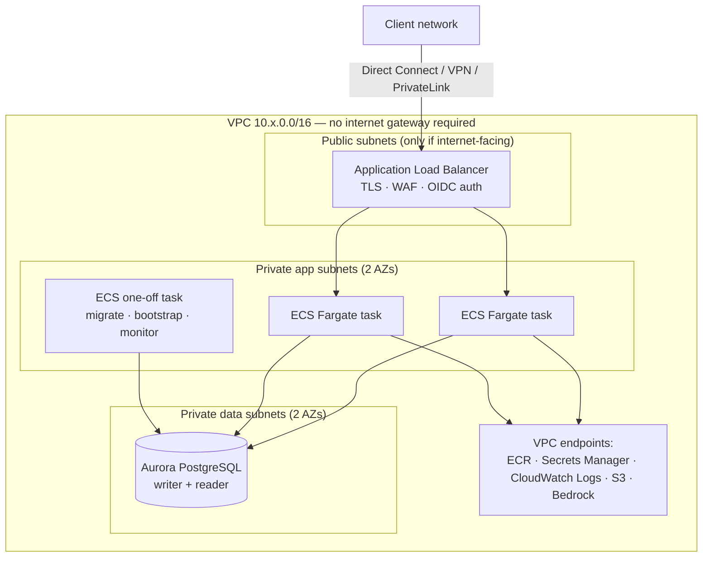

# 05 — AWS reference architecture

Target: ADPM running on a client's AWS account, private to their network, with Aurora PostgreSQL as
the backend and Bedrock for agents.

This is the **reference architecture**. The click-through provisioning guide for the existing
implementation is [docs/AWS.md](../AWS.md); read both. Everything in
[hosting-prerequisites.md](../hosting-prerequisites.md) must be done before any of this works.

---

## 1. Service mapping

| Concern | Service | Notes |
|---|---|---|
| **Compute** | **ECS Fargate** behind an internal ALB | No servers to patch, scales to zero-ish cost at pilot size. App Runner is simpler but has weaker VPC and WAF control; EC2 only if the client forbids Fargate |
| **Database** | **Aurora PostgreSQL Serverless v2**, 16 | RDS for PostgreSQL is a legitimate cheaper alternative at steady small scale |
| **Container registry** | ECR, with scan-on-push | |
| **Secrets** | AWS Secrets Manager | `DATABASE_URL`, `AUTH_SECRET`. Rotation for the DB credential |
| **Identity** | Cognito user pool federated to the client IdP, **or** ALB OIDC authentication directly against it | Option B / Option A in [02 §5.2](02-architecture.md) |
| **Ingress** | Internal ALB + ACM certificate + AWS WAF | Public ALB only if the client explicitly wants internet exposure |
| **DNS** | Route 53 private hosted zone, or the client's own DNS | |
| **Models** | **Amazon Bedrock** (Anthropic Claude), via VPC endpoint | Keeps inference in-region and off the internet |
| **Object storage** | S3 for the optional artifact mirror and export cache | Not required; the mirror can be `off` |
| **Scheduled jobs** | EventBridge Scheduler → ECS RunTask | Migrations, bootstrap, L3 monitoring |
| **Observability** | CloudWatch Logs + Container Insights; X-Ray optional | |
| **IaC** | Terraform (preferred) or CDK | |

---

## 2. Network topology



Security groups, minimum viable set:

| SG | Inbound | Outbound |
|---|---|---|
| `alb-sg` | 443 from the client CIDR ranges only | 3000 to `app-sg` |
| `app-sg` | 3000 from `alb-sg` | 5432 to `db-sg`; 443 to VPC endpoints |
| `db-sg` | 5432 from `app-sg` and `job-sg` | none |
| `job-sg` | none | 5432 to `db-sg`; 443 to endpoints |

With interface endpoints for ECR, Secrets Manager, CloudWatch Logs and Bedrock, plus a gateway
endpoint for S3, the task subnets need **no NAT gateway and no internet route**. That is both the
cheaper and the more defensible design; make it the default and justify any deviation.

---

## 3. Database — Aurora PostgreSQL

| Setting | Pilot | Production |
|---|---|---|
| Engine | Aurora PostgreSQL 16 | same |
| Capacity | Serverless v2, 0.5–2 ACU | 1–8 ACU, plus a reader if reporting load appears |
| Multi-AZ | Single writer | Writer + reader in a second AZ |
| Backup retention | 7 days | 14–35 days, PITR on |
| Encryption | KMS default key | Customer-managed KMS key |
| Public access | Disabled | Disabled |
| TLS | `sslmode=require` minimum; `verify-full` with the RDS CA bundle where the client requires it | |
| Parameter group | `statement_timeout=30s`, `idle_in_transaction_session_timeout=60s`, `lock_timeout=10s` | |
| Deletion protection | On | On |

**Connections.** Aurora Serverless v2 at 1 ACU allows a few hundred connections, but Prisma pools per
task. Set `connection_limit=5` in `DATABASE_URL`, cap the ECS service at 4 tasks, and add **RDS
Proxy** before going beyond that. RDS Proxy also gives IAM authentication and connection reuse
across deploys, which removes the connection-storm risk during rolling updates.

**Credentials.** Prefer IAM database authentication with the task role, so no password exists:
the application then builds `DATABASE_URL` from a token at start-up. If that is too much change for
v1, store the full URL in Secrets Manager with rotation enabled and inject it as a task secret.

**Roles.** Create `adpm_app` (no `DELETE`, no DDL), `adpm_migrator` (owner), `adpm_reader`
(`SELECT`) as described in [03 §5.2](03-data-model.md). The ECS task uses `adpm_app`; the migration
job uses `adpm_migrator`.

---

## 4. Compute — ECS Fargate

```
Cluster:          adpm-<env>
Service:          adpm-web       desired 2, min 1, max 4
Task:             1 vCPU / 2 GB   (raise to 2 vCPU / 4 GB if exports are heavy)
Health check:     GET /api/health   [GAP] B6 — must be built
Deployment:       rolling, minimumHealthyPercent 100, maximumPercent 200
Circuit breaker:  enabled with rollback
Task role:        Bedrock InvokeModel (only if agents enabled), S3 mirror prefix
Execution role:   ECR pull, Secrets Manager read, CloudWatch Logs write
Logging:          awslogs → /ecs/adpm-<env>, 90-day retention
```

Environment (non-secret) and secrets (from Secrets Manager) exactly as
[02 §8.3](02-architecture.md#83-runtime-configuration).

---

## 5. Identity

**Fastest safe option — ALB OIDC.** Configure an `authenticate-oidc` action on the HTTPS listener
against the client IdP. The ALB authenticates before any request reaches the container and forwards
`x-amzn-oidc-identity` / `x-amzn-oidc-data`. The application then trusts that header for identity —
which is only safe because `app-sg` accepts traffic exclusively from `alb-sg`. Keep the in-app
sign-in page reachable only for break-glass admin access, or remove it entirely.

**Longer-term — Cognito or direct OIDC in the app.** A Cognito user pool federated to the client IdP
gives group claims that map cleanly onto `RoleAssignment` (02 §5.4) and works for future non-browser
clients. Either way, implement JIT provisioning and deactivation-on-group-removal.

**Never** expose the credentials sign-in with seeded accounts on an internet-facing ALB
(**[GAP]** B1).

---

## 6. Models — Bedrock

- Enable the Anthropic Claude models the workspace will use in the target region, and confirm the
  exact model identifiers in the client's account. **[VERIFY]** — model availability and naming vary
  by region and change over time; do not hard-code an identifier from this document.
- Reach Bedrock over an **interface VPC endpoint** so inference never leaves the client's network
  path and no NAT gateway is needed.
- Authorise with the ECS task role (`bedrock:InvokeModel` on the specific model ARNs), not an API
  key. This removes the `ANTHROPIC_API_KEY` secret entirely on AWS.
- The provider abstraction already isolates this: a Bedrock provider implements the same interface
  as the Anthropic and local-heuristic providers ([08 §3](08-agents-llm.md)). Nothing above the
  provider knows which one ran.
- Enable Bedrock model-invocation logging to CloudWatch or S3 if the client's AI governance requires
  a second, independent record of every call. The `AgentAction` table is the primary record.
- **Guardrails.** Bedrock Guardrails can add an independent content filter. Useful, but it is not a
  substitute for scope enforcement and redaction, which happen before the call.

---

## 7. Terraform skeleton

Module layout that has proven to work; each module is small enough to review in one sitting.

```
infra/aws/
  main.tf                 # providers, backend (S3 + DynamoDB lock), tags
  network.tf              # VPC, subnets, route tables, endpoints, security groups
  database.tf             # Aurora cluster, parameter group, subnet group, secret
  registry.tf             # ECR repository, lifecycle policy
  compute.tf              # ECS cluster, task definition, service, autoscaling
  ingress.tf              # ALB, listener, ACM cert, WAF web ACL, OIDC action
  jobs.tf                 # migration / bootstrap / monitor task definitions + schedules
  observability.tf        # log groups, metric filters, alarms, dashboard
  iam.tf                  # task role, execution role, least-privilege policies
  variables.tf outputs.tf
```

Illustrative fragments — adapt, do not copy blindly:

```hcl
resource "aws_rds_cluster" "adpm" {
  cluster_identifier      = "adpm-${var.env}"
  engine                  = "aurora-postgresql"
  engine_mode             = "provisioned"
  engine_version          = "16.4"
  database_name           = "adpm"
  master_username         = "adpm_migrator"
  manage_master_user_password = true          # Secrets Manager, rotated
  db_subnet_group_name    = aws_db_subnet_group.data.name
  vpc_security_group_ids  = [aws_security_group.db.id]
  storage_encrypted       = true
  kms_key_id              = var.kms_key_arn
  backup_retention_period = var.env == "prod" ? 30 : 7
  deletion_protection     = true
  serverlessv2_scaling_configuration {
    min_capacity = 0.5
    max_capacity = var.env == "prod" ? 8 : 2
  }
}

resource "aws_ecs_task_definition" "web" {
  family                   = "adpm-web-${var.env}"
  requires_compatibilities = ["FARGATE"]
  network_mode             = "awsvpc"
  cpu                      = "1024"
  memory                   = "2048"
  execution_role_arn       = aws_iam_role.execution.arn
  task_role_arn            = aws_iam_role.task.arn
  container_definitions = jsonencode([{
    name  = "web"
    image = "${aws_ecr_repository.adpm.repository_url}:${var.image_tag}"
    portMappings = [{ containerPort = 3000 }]
    environment = [
      { name = "AUTH_TRUST_HOST",      value = "true" },
      { name = "ADPM_WORKSPACE_DIR",   value = "off" },
      { name = "NODE_ENV",             value = "production" },
    ]
    secrets = [
      { name = "DATABASE_URL", valueFrom = aws_secretsmanager_secret.database_url.arn },
      { name = "AUTH_SECRET",  valueFrom = aws_secretsmanager_secret.auth_secret.arn },
    ]
    healthCheck = {
      command  = ["CMD-SHELL", "node -e \"fetch('http://localhost:3000/api/health').then(r=>process.exit(r.ok?0:1)).catch(()=>process.exit(1))\""]
      interval = 30, timeout = 5, retries = 3, startPeriod = 30
    }
    logConfiguration = {
      logDriver = "awslogs"
      options = {
        awslogs-group         = aws_cloudwatch_log_group.web.name
        awslogs-region        = var.region
        awslogs-stream-prefix = "web"
      }
    }
  }])
}
```

The migration job is the same image with a different command:

```hcl
resource "aws_ecs_task_definition" "migrate" {
  family = "adpm-migrate-${var.env}"
  # … same image, adpm_migrator credentials …
  # command = ["pnpm", "exec", "prisma", "migrate", "deploy", "--schema", "prisma/schema.postgres.prisma"]
}
```

---

## 8. Deployment runbook

**First deployment**

1. Terraform apply the network, database, registry and secrets modules.
2. Create the database roles (`adpm_app`, `adpm_migrator`, `adpm_reader`) from a bastion or an
   ECS exec session.
3. Build and push the image to ECR from the pipeline (never from a laptop for a client environment).
4. Run the **migration** task; confirm it exits 0 and the 35 tables exist.
5. Run the **bootstrap** task ([04 §6](04-data-loading.md)); confirm the workspace, the pack and the
   admin user.
6. Terraform apply compute and ingress. Confirm the ALB target group goes healthy.
7. Sign in as the admin through the IdP. Run the role-coverage query from
   [04 §4.1](04-data-loading.md#41-tenancy-and-people).
8. Run the nine reconciliation queries ([04 §8](04-data-loading.md)). All must return zero rows.

**Every subsequent deployment**

```
push image → run migration task → wait for exit 0 → update service (rolling) → smoke test → done
```

Rollback: redeploy the previous task definition revision. **Database migrations do not roll back** —
that is why every migration must be backwards compatible with the previous revision
([03 §6](03-data-model.md)).

---

## 9. Observability and alarms

| Alarm | Threshold | Action |
|---|---|---|
| ALB 5xx rate | > 1% for 5 min | Page |
| Target response time p95 | > 2 s for 10 min | Investigate |
| ECS running task count | < desired for 10 min | Page |
| Aurora CPU | > 80% for 15 min | Scale ACU ceiling |
| Aurora connections | > 80% of max | Reduce `connection_limit` or add RDS Proxy |
| Migration task non-zero exit | any | Block deploy, page |
| Backup failure | any | Page |
| Agent spend per workspace | > 80% of budget | Notify the workspace admin |

Log the request id, user id, workspace id, action, duration and outcome as structured JSON. Never
log artifact content.

---

## 10. Indicative cost

Design-time estimate only — **[VERIFY]** in the client's account, region and discount agreements.

| Item | Pilot (2 tasks, 0.5–2 ACU) | Production (2–4 tasks, 1–8 ACU) |
|---|---|---|
| ECS Fargate | ~$70/mo | ~$150–300/mo |
| Aurora Serverless v2 | ~$60–110/mo | ~$200–600/mo |
| ALB | ~$20/mo | ~$25/mo |
| VPC endpoints (5 interface) | ~$40/mo | ~$40/mo |
| Secrets, ECR, CloudWatch | ~$15/mo | ~$40/mo |
| Bedrock | usage-based; a Sonnet-class drafting call over one stage's artifacts is cents, not dollars | budget per workspace and enforce it |
| **Total excluding models** | **~$200–260/mo** | **~$450–1,000/mo** |

Removing NAT gateways by using VPC endpoints is worth roughly $35/month per AZ and is the single
easiest saving. Aurora is the dominant line; RDS `db.t4g.medium` Multi-AZ is materially cheaper if
the workload is genuinely steady and small.

---

## 11. AWS-specific gotchas

- **ALB idle timeout (60 s default)** will cut long export downloads. Raise it to 120 s for the
  export paths, or stream with periodic flushes.
- **Fargate ephemeral storage is 20 GB and disappears on restart.** Keep `ADPM_WORKSPACE_DIR=off` or
  point the mirror at EFS if the client genuinely wants it (they usually do not — nothing reads it).
- **Secrets Manager rotation changes the password**, and a running task keeps the old
  `DATABASE_URL`. Either use RDS Proxy with IAM auth, or force a service deployment as part of
  rotation.
- **ECS exec** is the safe way to reach the database for administration — it removes the need for a
  bastion host entirely. Enable it deliberately and audit its use.
- **Bedrock model access must be requested per account and region** before the first call succeeds.
  Do this in week one; it is not instantaneous in every organisation.
