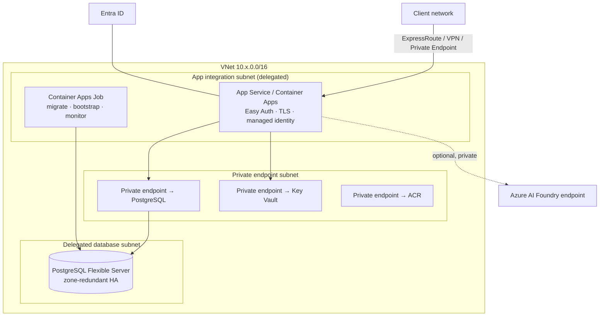

# 06 — Azure reference architecture

Target: ADPM running in a client's Azure subscription, private to their network, with Azure Database
for PostgreSQL Flexible Server as the backend, Entra ID for identity, and a managed model endpoint
for agents.

The click-through provisioning guide for the existing implementation is
[docs/AZURE.md](../AZURE.md); read both. Everything in
[hosting-prerequisites.md](../hosting-prerequisites.md) must be done first.

**Azure is the easiest of the three for this application**, for one specific reason: App Service
Easy Auth solves the authentication gap (**[GAP]** B1) with configuration rather than code, against
the identity provider the client almost certainly already uses.

---

## 1. Service mapping

| Concern | Service | Notes |
|---|---|---|
| **Compute** | **App Service for Containers** (Linux) or **Container Apps** | App Service for a pilot — Easy Auth is built in. Container Apps when you want scale-to-zero, jobs and revisions in one platform |
| **Database** | **Azure Database for PostgreSQL — Flexible Server**, 16 | Built-in PgBouncer, zone-redundant HA, Entra ID auth |
| **Registry** | Azure Container Registry, with Defender scanning | |
| **Secrets** | Azure Key Vault, referenced from app settings | `@Microsoft.KeyVault(SecretUri=…)` |
| **Identity** | **Entra ID** via App Service Easy Auth, or MSAL/OIDC in the app | Easy Auth is the fast, safe answer |
| **Ingress** | App Service built-in TLS, plus Front Door or Application Gateway + WAF where required | |
| **Private networking** | VNet integration + Private Endpoint for both the app and the database | |
| **Models** | **Azure AI Foundry** model endpoint, or Anthropic API over controlled egress | **[VERIFY]** availability of Anthropic Claude models in the client's tenant and region |
| **Object storage** | Azure Blob Storage (optional mirror, export cache) | |
| **Jobs** | Container Apps Jobs, or App Service WebJobs | Migrations, bootstrap, L3 monitoring |
| **Observability** | Application Insights + Log Analytics | |
| **IaC** | Bicep (native) or Terraform | |

---

## 2. Network topology



Rules: public network access **disabled** on the database and Key Vault; the app reaches both over
private endpoints with private DNS zones (`privatelink.postgres.database.azure.com`,
`privatelink.vaultcore.azure.net`). If the client requires no public app ingress either, add a
private endpoint for the app and publish it through their internal DNS.

---

## 3. Database — PostgreSQL Flexible Server

| Setting | Pilot | Production |
|---|---|---|
| Tier / SKU | Burstable B2s | General Purpose D2ds_v5 or D4ds_v5 |
| Storage | 32–64 GB | 128 GB+, autogrow on |
| Version | 16 | 16 |
| HA | None (single zone) | **Zone-redundant HA** |
| Backups | 7 days, PITR | 14–35 days, geo-redundant if the client requires it |
| Network | Private access (VNet integration) or private endpoint; public access disabled | same |
| TLS | Required; `sslmode=require` (`verify-full` with the Microsoft root CA where mandated) | same |
| Auth | Entra ID authentication with the app's managed identity, plus one break-glass admin | same |
| Server parameters | `statement_timeout=30000`, `idle_in_transaction_session_timeout=60000`, `lock_timeout=10000` | same |
| Connection pooling | **Enable built-in PgBouncer** (port 6432), transaction mode | same |

**Connections are the thing to get right on Azure.** A Burstable B2s allows relatively few
connections, and Container Apps will happily scale to ten replicas. Two controls, both required:

1. `connection_limit=5` in `DATABASE_URL`, and a `maxReplicas` that keeps
   `replicas × 5 + admin headroom` under the server's `max_connections`.
2. Point the application at **PgBouncer on 6432** rather than 5432. In transaction pooling mode,
   disable prepared statements in the connection string (`pgbouncer=true` for Prisma) or you will
   see intermittent `prepared statement "s0" already exists` errors under load — the classic Azure
   symptom of this misconfiguration.

**Roles.** `adpm_app` (no `DELETE`, no DDL), `adpm_migrator` (owner), `adpm_reader` (`SELECT`) as in
[03 §5.2](03-data-model.md). With Entra ID auth, map the app's managed identity to `adpm_app` and the
job's identity to `adpm_migrator`; then no password exists in any secret.

---

## 4. Compute

### Option A — App Service for Containers (recommended for a pilot)

```
Plan:            P1v3 (2 vCPU / 8 GB), Linux
Container:       ACR image, pulled with managed identity
Always On:       enabled
Health check:    /api/health          [GAP] B6 — must be built
VNet:            regional integration, route-all enabled
Identity:        system-assigned managed identity (ACR pull, Key Vault get, Postgres login)
Slots:           staging slot with swap for zero-downtime deploys
App settings:    WEBSITES_PORT=3000, AUTH_TRUST_HOST=true, ADPM_WORKSPACE_DIR=off
Secrets:         Key Vault references for DATABASE_URL and AUTH_SECRET
```

### Option B — Container Apps

Choose when you want revisions, scale-to-zero and **Container Apps Jobs** in the same environment as
the app (jobs are the cleanest way to run migrations and the scheduled monitoring agent).
Constrain scaling: `minReplicas: 1`, `maxReplicas: 3–4`, HTTP concurrency rule around 40. Authenticate
with Easy Auth here too — Container Apps supports the same built-in auth.

---

## 5. Identity — Easy Auth

This is Azure's decisive advantage. Configure the App Service or Container App authentication
provider against Entra ID:

```
Require authentication:            Yes
Unauthenticated requests:          HTTP 302 to the identity provider
Token store:                       Enabled
Allowed audiences / app roles:     ADPM.Practitioner, ADPM.Consumer, ADPM.Admin, …
```

The platform authenticates before any request reaches the container and injects
`X-MS-CLIENT-PRINCIPAL`, `X-MS-CLIENT-PRINCIPAL-NAME` and `X-MS-CLIENT-PRINCIPAL-ID`. The
application then:

1. Reads the principal from the header (safe only because the container accepts traffic exclusively
   through the platform's front end — verify that assumption in the client's configuration).
2. JIT-provisions the `User` row on first sight ([02 §5.3](02-architecture.md)).
3. Maps Entra app roles or group claims to `RoleAssignment` ([02 §5.4](02-architecture.md)).
4. Sets `archivedAt` when a principal loses every ADPM role.

Keep the built-in credentials sign-in for break-glass only, or remove it. Do not expose seeded
accounts (**[GAP]** B1).

---

## 6. Models

Azure is the one cloud where model access needs an explicit decision, taken with the client:

| Route | What it means | When |
|---|---|---|
| **Azure AI Foundry model endpoint** | Inference inside the client's Azure tenant and region, reachable over a private endpoint, authenticated with managed identity | Preferred where the required Claude models are available to the client's tenant and region — **[VERIFY]** this first, in their subscription, before designing around it |
| **Anthropic API over controlled egress** | Egress through a firewall/proxy allow-listing the API endpoint, API key in Key Vault | Acceptable when the client permits controlled internet egress and their data-residency policy allows it |
| **Agents off / local heuristic** | No model call at all; the deterministic provider runs and the lifecycle is fully demonstrable | The correct answer for a first pilot in a locked-down network, and a perfectly complete deployment |

The provider abstraction ([08 §3](08-agents-llm.md)) means this choice is one adapter and one
configuration value, not an architecture change. Whatever is chosen, `AgentAction.model` records
what **actually ran** and `configuredModel` what was assigned, so the log never implies a model ran
that did not.

---

## 7. Bicep skeleton

```
infra/azure/
  main.bicep              # subscription/resource-group scope, tags
  network.bicep           # VNet, subnets, NSGs, private DNS zones
  database.bicep          # Flexible Server, firewall/private endpoint, parameters, PgBouncer
  registry.bicep          # ACR
  app.bicep               # App Service plan + site, or Container Apps environment + app
  auth.bicep              # Easy Auth configuration
  jobs.bicep              # Container Apps Jobs: migrate, bootstrap, monitor
  observability.bicep     # Log Analytics, App Insights, alerts
  keyvault.bicep          # Key Vault, access policies / RBAC, secrets
```

Illustrative fragment:

```bicep
resource pg 'Microsoft.DBforPostgreSQL/flexibleServers@2023-12-01-preview' = {
  name: 'adpm-${env}-pg'
  location: location
  sku: { name: env == 'prod' ? 'Standard_D2ds_v5' : 'Standard_B2s'
         tier: env == 'prod' ? 'GeneralPurpose' : 'Burstable' }
  properties: {
    version: '16'
    storage: { storageSizeGB: env == 'prod' ? 128 : 64, autoGrow: 'Enabled' }
    backup: { backupRetentionDays: env == 'prod' ? 30 : 7, geoRedundantBackup: 'Disabled' }
    highAvailability: { mode: env == 'prod' ? 'ZoneRedundant' : 'Disabled' }
    network: { delegatedSubnetResourceId: dbSubnetId, privateDnsZoneArmResourceId: dnsZoneId }
    authConfig: { activeDirectoryAuth: 'Enabled', passwordAuth: 'Enabled' }
  }
}

resource pgbouncer 'Microsoft.DBforPostgreSQL/flexibleServers/configurations@2023-12-01-preview' = {
  parent: pg
  name: 'pgbouncer.enabled'
  properties: { value: 'true', source: 'user-override' }
}
```

---

## 8. Deployment runbook

**First deployment**

1. Deploy network, Key Vault, ACR and the database.
2. Create database roles; grant the app's managed identity `adpm_app` and the job's identity
   `adpm_migrator`.
3. Build and push the image from the pipeline to ACR.
4. Run the **migration** job; confirm exit 0 and 35 tables.
5. Run the **bootstrap** job ([04 §6](04-data-loading.md)).
6. Deploy the app; configure Easy Auth; confirm the health check.
7. Sign in through Entra ID; run the role-coverage query.
8. Run the nine reconciliation queries ([04 §8](04-data-loading.md)) — all zero rows.

**Every subsequent deployment**

```
push image → migration job → exit 0 → deploy to staging slot → smoke test → swap → verify
```

Slot swap gives an instant rollback path for the application. **Database migrations do not roll
back**; keep them backwards compatible.

---

## 9. Observability and alerts

Application Insights for request telemetry, dependency calls and failures; Log Analytics for
container logs and job outcomes.

| Alert | Threshold |
|---|---|
| HTTP 5xx rate | > 1% over 5 min |
| Response time p95 | > 2 s over 10 min |
| App restarts | > 3 in 15 min |
| PostgreSQL CPU / memory | > 80% for 15 min |
| PostgreSQL active connections | > 80% of max |
| Failed job run | any |
| Backup failure | any |
| Agent spend per workspace | > 80% of budget |

---

## 10. Indicative cost

Design-time estimate — **[VERIFY]** in the client's subscription and agreement.

| Item | Pilot | Production |
|---|---|---|
| App Service P1v3 (or Container Apps equivalent) | ~$120/mo | ~$240/mo (2 instances) |
| PostgreSQL Flexible Server | ~$45/mo (B2s, 64 GB) | ~$250–400/mo (D2ds_v5, zone-redundant HA) |
| ACR (Standard) | ~$20/mo | ~$20/mo |
| Key Vault, private endpoints, DNS | ~$30/mo | ~$50/mo |
| Log Analytics + App Insights | ~$25/mo | ~$80/mo (volume-dependent) |
| Models | usage-based, budgeted per workspace | usage-based |
| **Total excluding models** | **~$240/mo** | **~$640–790/mo** |

---

## 11. Azure-specific gotchas

- **`WEBSITES_PORT` must match the container's port** (3000) or App Service will report a healthy
  container that never serves traffic.
- **PgBouncer transaction mode + Prisma prepared statements** is the number-one production symptom
  on Azure. Set `pgbouncer=true` in the connection string (§3).
- **Easy Auth headers are only trustworthy if the container cannot be reached directly.** Confirm
  the app has no public inbound path that bypasses the platform front end.
- **Key Vault references resolve at app start.** Rotating a secret needs a restart, or the app keeps
  the old value.
- **Container Apps scale to zero by default**, which means a cold start on the first request after
  idle and a burst of database connections when several replicas start at once. `minReplicas: 1` for
  anything a client will click on.
- **Regional VNet integration requires a dedicated, delegated subnet** with enough address space for
  scale-out; a /27 that seemed generous will block scaling later.
