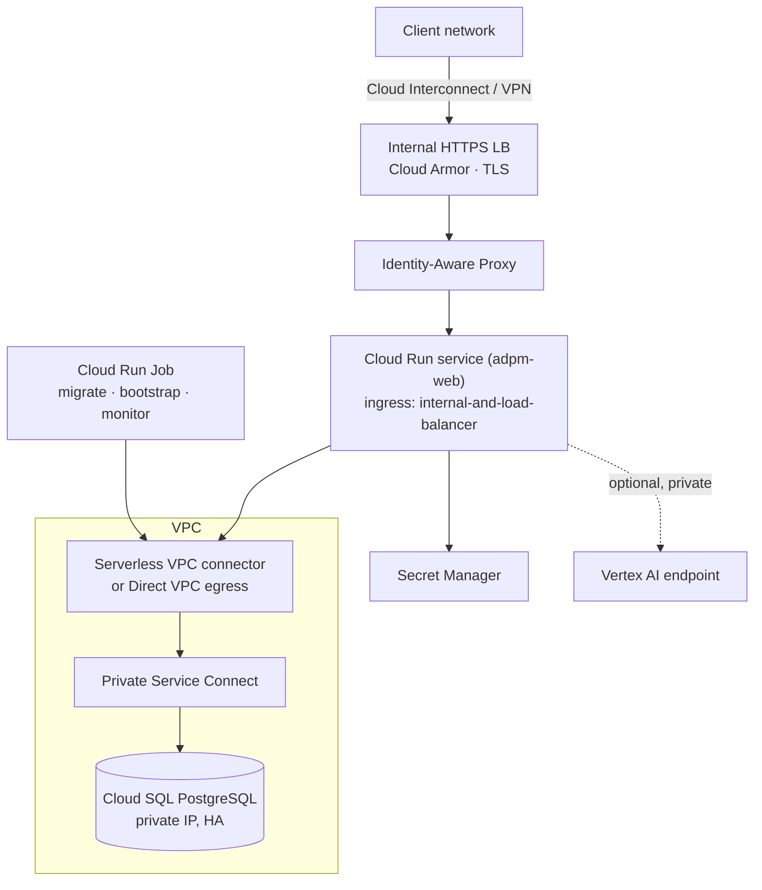

# 07 — GCP reference architecture

Target: ADPM running in a client's Google Cloud project, private to their network, with Cloud SQL for
PostgreSQL as the backend, Identity-Aware Proxy for access control, and Vertex AI for agents.

The click-through provisioning guide for the existing implementation is
[docs/GCP.md](../GCP.md); read both. Everything in
[hosting-prerequisites.md](../hosting-prerequisites.md) must be done first.

GCP's decisive advantage here is **IAP**: identity-aware access in front of the application, with the
client's Google identities and IAM, configured rather than coded. Its decisive risk is **Cloud Run's
scaling model** meeting a small Cloud SQL instance's connection limit.

---

## 1. Service mapping

| Concern | Service | Notes |
|---|---|---|
| **Compute** | **Cloud Run** (service) | Fully managed, scales to zero, honours `PORT`. Compute Engine only if the client forbids Cloud Run |
| **Database** | **Cloud SQL for PostgreSQL 16** | AlloyDB only if the client already standardises on it — heavier and dearer than this workload needs |
| **Registry** | Artifact Registry, with vulnerability scanning | |
| **Secrets** | Secret Manager, mounted as environment variables | |
| **Identity** | **Identity-Aware Proxy** in front of Cloud Run, backed by Cloud Identity / Workspace or an external IdP through Workforce Identity Federation | |
| **Ingress** | Internal or external HTTPS load balancer + Cloud Armor | Internal-only for a private client deployment |
| **Private networking** | Serverless VPC Access connector (or Direct VPC egress) + Private Service Connect to Cloud SQL | |
| **Models** | **Vertex AI** (Anthropic Claude in Model Garden) via Private Service Connect | **[VERIFY]** model availability in the client's region and project |
| **Object storage** | Cloud Storage (optional mirror, export cache) | |
| **Jobs** | **Cloud Run Jobs** + Cloud Scheduler | Migrations, bootstrap, L3 monitoring |
| **Observability** | Cloud Logging, Cloud Monitoring, Error Reporting | |
| **IaC** | Terraform | |

---

## 2. Network topology



Set the Cloud Run ingress to `internal-and-cloud-load-balancing` and put IAP on the load balancer.
Disable the default `*.run.app` URL for client environments; otherwise there is a public entry point
sitting beside the one you secured.

---

## 3. Database — Cloud SQL for PostgreSQL

| Setting | Pilot | Production |
|---|---|---|
| Version | PostgreSQL 16 | 16 |
| Machine | db-custom-2-7680 (2 vCPU / 7.5 GB) | db-custom-4-15360 or larger |
| Storage | 50 GB SSD, auto-increase | 100 GB+ SSD, auto-increase |
| Availability | Zonal | **Regional (HA)** |
| Backups | Daily, 7-day retention, PITR on | Daily, 30-day retention, PITR on |
| Network | **Private IP only**, no public IP, no authorised networks | same |
| Encryption | Google-managed | CMEK where the client requires it |
| Connection | Cloud SQL connector / Auth Proxy with IAM database authentication | same |
| Flags | `max_connections` sized to replicas; `statement_timeout=30000`; `idle_in_transaction_session_timeout=60000`; `lock_timeout=10000` | same |

**The Cloud Run + Cloud SQL connection trap, and how to avoid it.** Cloud Run creates a new container
instance per concurrency bucket and can scale to hundreds. Each instance opens a Prisma pool. A
db-custom-2 instance allows a few hundred connections; a scale spike will exhaust them and every
request will fail with a connection error rather than a slow response. Three settings, all required:

1. `--max-instances=4` (pilot) or a deliberate, sized number in production.
2. `connection_limit=3..5` in `DATABASE_URL`.
3. `--concurrency=40` or higher, so one instance serves many requests instead of fanning out.

Add PgBouncer as a sidecar only if those three are genuinely insufficient; on this workload they are
not.

**Credentials.** Use IAM database authentication with the Cloud Run service account, so no password
exists. Otherwise store the URL in Secret Manager and mount it.

**Roles.** `adpm_app` (no `DELETE`, no DDL), `adpm_migrator` (owner), `adpm_reader` (`SELECT`), per
[03 §5.2](03-data-model.md).

---

## 4. Compute — Cloud Run

```
Service:        adpm-web
Image:          <region>-docker.pkg.dev/<project>/adpm/adpm:<tag>
CPU / memory:   1 vCPU / 2 GiB   (2 GiB matters — Next.js SSR plus exceljs/docx exports)
Concurrency:    40
Min instances:  1        (avoids cold starts on a screen a client is watching)
Max instances:  4        (see §3)
Timeout:        300 s    (long exports)
Ingress:        internal-and-cloud-load-balancing
Egress:         VPC connector, private-ranges-only unless a model endpoint needs more
Service account: adpm-web@… — Cloud SQL Client, Secret Manager accessor, Vertex AI user (if agents on)
Startup probe:  GET /api/health     [GAP] B6 — must be built
Env:            AUTH_TRUST_HOST=true, ADPM_WORKSPACE_DIR=off, NODE_ENV=production
Secrets:        DATABASE_URL, AUTH_SECRET from Secret Manager
```

Cloud Run **Jobs** (same image, different command) run migration, bootstrap and the scheduled
monitoring agent. Cloud Scheduler triggers the monitoring job; migrations are triggered by the
pipeline.

---

## 5. Identity — IAP

1. Put the service behind an internal (or external, if required) HTTPS load balancer with a
   serverless NEG.
2. Enable IAP on the backend service; grant `roles/iap.httpsResourceAccessor` to the client's Google
   groups.
3. IAP forwards a signed JWT in `x-goog-iap-jwt-assertion`. **Verify the signature and audience in
   the application** — do not trust the header blindly. This is stricter than the equivalent AWS and
   Azure header patterns and worth doing properly.
4. JIT-provision the `User` row from the verified claims; map Google groups to `RoleAssignment`
   ([02 §5.4](02-architecture.md)); archive users whose group membership disappears.

For a client whose identities live in Entra ID or Okta rather than Google, use Workforce Identity
Federation so IAP still applies. Keep the built-in credentials sign-in for break-glass only
(**[GAP]** B1).

---

## 6. Models — Vertex AI

- Anthropic Claude models are offered through Vertex AI Model Garden. Enable the specific models in
  the client's project and region and confirm the exact identifiers there — **[VERIFY]**;
  availability and naming vary by region and change over time.
- Authorise with the Cloud Run service account (`roles/aiplatform.user`), not an API key. On GCP,
  as on AWS, this removes the `ANTHROPIC_API_KEY` secret entirely.
- Reach Vertex over **Private Service Connect** so inference stays on the private path and no public
  egress is needed.
- Implement a Vertex provider behind the same interface as the local-heuristic and Anthropic
  providers ([08 §3](08-agents-llm.md)). Nothing above the provider knows which ran; `AgentAction`
  records what actually ran.
- If the client's region has no suitable model and cross-region inference is not acceptable under
  their residency policy, run agents in local-heuristic mode. The application is complete without
  model calls — say so plainly rather than weakening residency.

---

## 7. Terraform skeleton

```
infra/gcp/
  main.tf                 # provider, backend (GCS), project services enablement
  network.tf              # VPC, subnets, connector, PSC, firewall
  database.tf             # Cloud SQL instance, database, users, flags
  registry.tf             # Artifact Registry
  run.tf                  # Cloud Run service + jobs
  ingress.tf              # LB, serverless NEG, certificate, Cloud Armor, IAP
  scheduler.tf            # Cloud Scheduler → monitoring job
  observability.tf        # log-based metrics, alert policies, dashboard
  iam.tf                  # service accounts and least-privilege bindings
```

Illustrative fragment:

```hcl
resource "google_sql_database_instance" "adpm" {
  name             = "adpm-${var.env}"
  database_version = "POSTGRES_16"
  region           = var.region
  settings {
    tier              = var.env == "prod" ? "db-custom-4-15360" : "db-custom-2-7680"
    availability_type = var.env == "prod" ? "REGIONAL" : "ZONAL"
    disk_autoresize   = true
    ip_configuration {
      ipv4_enabled    = false
      private_network = google_compute_network.vpc.id
    }
    backup_configuration {
      enabled                        = true
      point_in_time_recovery_enabled = true
      transaction_log_retention_days = 7
    }
    database_flags {
      name  = "max_connections"
      value = "200"
    }
  }
  deletion_protection = true
}

resource "google_cloud_run_v2_service" "web" {
  name     = "adpm-web-${var.env}"
  location = var.region
  ingress  = "INGRESS_TRAFFIC_INTERNAL_LOAD_BALANCER"
  template {
    service_account = google_service_account.web.email
    max_instance_request_concurrency = 40
    scaling { min_instance_count = 1, max_instance_count = 4 }
    vpc_access {
      connector = google_vpc_access_connector.main.id
      egress    = "PRIVATE_RANGES_ONLY"
    }
    containers {
      image = var.image
      ports { container_port = 3000 }
      resources { limits = { cpu = "1", memory = "2Gi" } }
      env {
        name = "DATABASE_URL"
        value_source { secret_key_ref { secret = google_secret_manager_secret.db_url.secret_id, version = "latest" } }
      }
      startup_probe { http_get { path = "/api/health" } initial_delay_seconds = 10 }
    }
  }
}
```

---

## 8. Deployment runbook

**First deployment**

1. Enable APIs; apply network, Cloud SQL, Artifact Registry and Secret Manager.
2. Create database roles; grant the Cloud Run service account `adpm_app` and the job account
   `adpm_migrator` (IAM database auth).
3. Build and push the image from the pipeline to Artifact Registry.
4. Execute the **migration** Cloud Run Job; confirm success and 35 tables.
5. Execute the **bootstrap** job ([04 §6](04-data-loading.md)).
6. Deploy the service; apply the load balancer and enable IAP; grant access to the client group.
7. Sign in through IAP; run the role-coverage query.
8. Run the nine reconciliation queries ([04 §8](04-data-loading.md)) — all zero rows.

**Every subsequent deployment**

```
push image → migration job → success → deploy new revision with 0% traffic
  → smoke test the revision URL → shift 100% traffic → verify
```

Cloud Run revision traffic-splitting gives a clean rollback for the application. **Database
migrations do not roll back**; keep them backwards compatible ([03 §6](03-data-model.md)).

---

## 9. Observability and alerts

| Alert policy | Threshold |
|---|---|
| Cloud Run 5xx ratio | > 1% over 5 min |
| Request latency p95 | > 2 s over 10 min |
| Instance count at max | sustained 10 min (scaling ceiling reached) |
| Cloud SQL CPU | > 80% for 15 min |
| Cloud SQL connections | > 80% of `max_connections` |
| Job execution failure | any |
| Backup failure | any |
| Agent spend per workspace | > 80% of budget |

Log structured JSON to stdout — Cloud Logging parses it automatically and `severity`, `trace` and
`labels` become first-class. Never log artifact content.

---

## 10. Indicative cost

Design-time estimate — **[VERIFY]** in the client's project and region.

| Item | Pilot | Production |
|---|---|---|
| Cloud Run (min 1 instance, 1 vCPU / 2 GiB) | ~$45–70/mo | ~$120–250/mo |
| Cloud SQL | ~$100/mo (db-custom-2, zonal) | ~$350–500/mo (db-custom-4, regional HA) |
| Load balancer + Cloud Armor | ~$25/mo | ~$40/mo |
| VPC connector | ~$35/mo | ~$35/mo (or $0 with Direct VPC egress) |
| Artifact Registry, Secret Manager, logging | ~$20/mo | ~$60/mo |
| Vertex AI | usage-based, budgeted per workspace | usage-based |
| **Total excluding models** | **~$225–250/mo** | **~$600–885/mo** |

Cloud SQL dominates. Regional HA roughly doubles the database line and is the right call for a
production governance system whose contents are the audit record.

---

## 11. GCP-specific gotchas

- **Cloud Run scaling versus Cloud SQL connections** is the failure mode on this platform. §3 is not
  optional advice.
- **Min instances = 0 means cold starts.** A Next.js SSR container takes seconds to warm; a client
  clicking through a demo will see it. Keep `min_instance_count = 1`.
- **The default `*.run.app` URL bypasses your load balancer and IAP.** Set ingress to
  internal-and-load-balancer, and verify from an unauthenticated network that the direct URL is
  refused.
- **IAP JWT verification must be implemented in the application.** Trusting the header without
  verifying the signature and audience is the same class of mistake as trusting a client-side role.
- **VPC connector throughput is a real limit** on the older connector; prefer Direct VPC egress where
  available.
- **Cloud Run request timeout caps long exports** — 300 s is generous, but stream large DOCX/XLSX
  responses rather than buffering them.
- **Vertex model enablement is per project and region** and may need an organisation-level approval
  in a regulated client. Start that request in week one.
