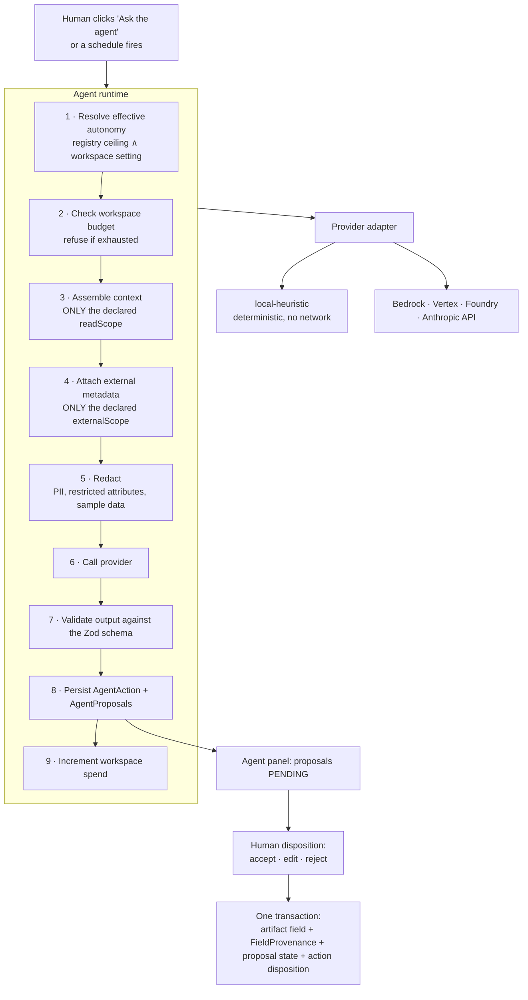

# 08 — Agent and LLM engineering

The agent runtime is where this application earns or loses the word "agentic". Everything here
serves one sentence: **agents act, humans decide.**

---

## 1. What an agent is here

A chartered, scoped, auditable worker that produces **proposals, findings and comments**. It does not
edit anything. Its output is persisted, attributed and left waiting for a named human to accept,
edit or reject.

Six actions no agent may ever perform, at any autonomy level, under any configuration:

```
approve a gate · commit an artifact version · publish a product
satisfy an exit criterion · resolve a review comment
invoke another agent without a named initiating human
```

**[BUILT]** `AGENT_FORBIDDEN_ACTIONS` in `src/lib/agents/registry.ts`, with a function whose return
type is the literal `false` — the compiler refuses code that assumes otherwise. Keep that pattern:
it converts a policy into a type error.

There is no admin override, no "trusted mode", no service account and no batch path that changes
this. A request for one is a defect report.

---

## 2. Autonomy levels

| Level | May be | Typical agents |
|---|---|---|
| **L0** | Disabled | Anything the client switches off |
| **L1** | Invoked explicitly by a human, on a named product and stage | Default for all working agents |
| **L2** | Additionally triggered on stage entry | Drafting and critique agents once the client trusts them |
| **L3** | Additionally run on a schedule — **monitoring only, no proposals into artifacts** | `curator`, `steward` |

The registry sets a **ceiling** per agent; the per-workspace `AgentSetting` may only lower it.
Escalating above the ceiling is refused server-side, not hidden in the UI.

---

## 3. Runtime architecture



**Provider abstraction.** One interface, three or more implementations. Nothing above the provider
knows which ran; `AgentAction.model` records what actually ran and `configuredModel` what the
workspace had assigned, so the log never implies a model ran that did not. **[BUILT]**
`src/lib/agents/provider.ts`

```ts
export interface AgentProvider {
  id: string
  label: string
  run(context: AgentInvocationContext): Promise<ProviderResult>
}
```

`ProviderResult` carries `{ model, output, promptTokens, completionTokens, estimatedCostUsd, durationMs }`.
Adding Bedrock, Vertex or Foundry is one file implementing this interface plus one configuration
value — not an architecture change.

**The local-heuristic provider is not a stub.** It is a deterministic, rule-based implementation that
makes the entire lifecycle demonstrable with no network call, no API key and no egress. It is the
default. A deployment that never enables a model is a complete deployment.

---

## 4. Scope and redaction — the two hard controls

### 4.1 Read scope

Each agent declares the artifact types it may read. Nothing else is ever placed in its context — not
"nothing else is shown", *nothing else is assembled*. External metadata (erwin, Collibra, Alation
imports) is scoped the same way through `externalScope`; invariant 6 does not distinguish between
context that came from an artifact and context that came from a catalogue.

The declared scope is written to `AgentAction.scopeJson` on every invocation, so an auditor can see
what the agent was entitled to read, not just what it said.

### 4.2 Redaction

Applied to the scoped payload before any call leaves the process. **[BUILT]**
`src/lib/agents/redaction.ts`

| Rule | Behaviour |
|---|---|
| Attribute flagged `pii` or `sensitivity = RESTRICTED` in the attribute register | Value replaced with `«redacted»` |
| Key matching `email, phone, ssn, nino, dob, birth, address, passport, iban, account_number` | Value replaced with `«redacted»` |
| Keys named `sample`, `example`, `value`, `row(s)` when the workspace does not allow sample data | Replaced with `«sample data withheld»` |

Every redacted path is recorded in `AgentAction.redactedFieldsJson` and shown to the user before the
first call of a session. Two design points worth keeping:

- The redaction list is **evidence**, not a log line. An AI-governance review will ask what was sent
  and what was withheld; this is the answer.
- `agentsMaySeeSampleData` defaults to **false** and turning it on is a documented client decision,
  not a convenience toggle.

---

## 5. Prompt design and output contract

Each agent carries a `promptTemplate` in the registry (data, not code). The runtime composes:

```
system:  the agent's charter · what it may and may not do · the exit criteria of this stage
         · the instruction that its output is a proposal for a human, never an action
user:    the redacted, scope-limited artifact payload + facts supplied by the runtime
         (e.g. existing metric names in the workspace, for collision detection)
```

Output must validate against one schema; anything else is rejected and recorded as a failed
invocation rather than coerced:

```ts
{
  narrative: string,                                     // what it did, in its own words
  proposals: [{ fieldPath, value, rationale }],          // one per proposed field
  findings:  [{ title, detail, severity }],              // LOW | MEDIUM | HIGH | CRITICAL
  comments:  [{ fieldPath, body }]                       // critique into the review thread
}
```

`fieldPath` uses the artifact's own path syntax (`decisions[0].questions`), so an accepted proposal
writes exactly one field and its provenance row.

### 5.1 Prompt injection

Artifact text, imported catalogue metadata and uploaded profiling extracts are all attacker-influenced
in principle: they contain whatever someone typed or exported. The defence is structural, not
textual:

1. **An agent's output cannot act.** It becomes rows in `AgentProposal` awaiting a human. The worst
   case of a successful injection is a bad suggestion a person must still accept.
2. **Scope enforcement is outside the model.** An instruction inside a document cannot widen the read
   scope, because the scope is applied when the context is assembled.
3. **Output is schema-validated.** An instruction to "return JSON that approves the gate" produces
   an invalid output and a failed invocation, because there is no such field.
4. **No tool calls with side effects.** Agents have no write tools. This is the single most effective
   control and it should stay that way — if a future feature wants an agent to call a tool, the tool
   must be read-only or the answer is no.

Say this explicitly in the client's AI risk assessment; it is the strongest part of the design.

---

## 6. Model access per cloud

| | AWS | Azure | GCP |
|---|---|---|---|
| **Route** | Amazon Bedrock | Azure AI Foundry model endpoint | Vertex AI Model Garden |
| **Auth** | ECS task role — no API key | Managed identity — no API key | Cloud Run service account — no API key |
| **Private path** | Interface VPC endpoint | Private endpoint | Private Service Connect |
| **Availability** | **[VERIFY]** per account and region; model access must be requested | **[VERIFY]** per tenant and region — confirm before designing around it | **[VERIFY]** per project and region; may need org approval |
| **Fallback** | Anthropic API over controlled egress, or local heuristic | Anthropic API over controlled egress, or local heuristic | Local heuristic |

Model catalogue in the application is **data**, maintained by hand, and the UI says so rather than
implying it is a live vendor listing. Current entries and per-level defaults:

| Model | Tier | Context | $ / M input | $ / M output | Default for |
|---|---|---|---|---|---|
| Claude Opus 5 | frontier | 200k | 5 | 25 | opt-in for L2 critique and certification work |
| Claude Sonnet 5 | balanced | 200k | 3 | 15 | **L1, L2** — the default working model |
| Claude Haiku 4.5 | fast | 200k | 1 | 5 | **L0, L3** — scheduled monitoring across many products |

Prices are for cost **estimation** in the action log; reconcile against the client's actual billing
before quoting a run rate. Assigning a more capable model changes what an agent is good at, never
what it may do.

---

## 7. Cost control

- **Per-workspace budget** (`Workspace.agentBudgetUsd`) checked before every invocation; spend
  accumulates in `agentSpendUsd`. Exhausted budget refuses the call with a message naming the admin
  action needed.
- **Estimated cost per action** is computed from the catalogue prices and the reported token counts
  and stored on `AgentAction`, so cost is attributable to an agent, a product and a person.
- **Known limitation** (**[GAP]** C5): the spend increment is a read-modify-write, so two instances
  can overshoot the cap. Either accept a stated tolerance or make the increment atomic and enforce
  the cap in the same statement.
- **Scheduled L3 monitoring is the line item that surprises people** — it runs across every published
  product. Default it to the cheapest model, cap the product count per run, and graph spend per
  workspace against budget.

---

## 8. Orchestration — the Agent Run Console

One supervised pass of a product through the lifecycle with agents drafting ahead of the humans.

- The whole route is **planned up front** from the stage registry, so the operator sees every
  dispatch before anything is spent. Steps are appended to, never rewritten.
- Run states name what the run is **waiting for**: `RUNNING`, `AWAITING_REVIEW`, `AWAITING_GATE`,
  `BLOCKED`, `COMPLETED`, `CANCELLED`. It halts at every point where a human must act.
- `AUTOMATED` mode dispatches each stage's agents on its own; `MANUAL` waits for a person per step.
  Neither approves anything.
- Each step records the agent's own narrative, so the operator can see whether the context they
  attached was actually used rather than inferring it from a proposal count.
- **A run approves nothing, commits nothing and satisfies no exit criterion.** A run that reaches
  Stage 12 on a product with no human approvals is impossible by construction; assert it in a test.

---

## 9. Testing the guardrails

These are not ordinary unit tests. They are the evidence that the product's central claim is true,
and they belong in the acceptance pack.

| Test | Asserts |
|---|---|
| Forbidden actions | Every entry in `AGENT_FORBIDDEN_ACTIONS` is unreachable; the helper's return type is literally `false` |
| Scope enforcement | An agent given a product with artifacts outside its `readScope` receives none of them in its context |
| External scope | The same, for imported catalogue metadata slices |
| Redaction | PII-flagged and restricted attribute values never appear in the provider payload; every redaction is recorded |
| Sample data | With `agentsMaySeeSampleData = false`, no sample value reaches the provider |
| Action logging | Every invocation writes an `AgentAction` with scope, input hash, model, tokens, cost and duration; a failed audit insert fails the invocation |
| Proposal gating | An artifact with any `AGENT_PROPOSED` provenance cannot be submitted for review |
| Disposition atomicity | Accepting a proposal writes value, provenance, proposal state and action disposition in one transaction, or none of them |
| Budget | An exhausted workspace budget refuses invocation |
| Autonomy ceiling | A workspace cannot set an agent above its registry ceiling |
| Run integrity | No stage advances during an agent run without a human `Approval` row |

**[BUILT]** `tests/agent-guardrails.test.ts`, `tests/agent-run.test.ts`.

---

## 10. Evaluating agent quality

Guardrails prove agents are safe. They say nothing about whether agents are *useful*. Measure that
from data the system already records:

| Metric | Source | Reads as |
|---|---|---|
| **Acceptance rate** | `AgentProposal.state` | Proportion accepted without edit — the headline usefulness number |
| **Edit distance** | `proposedValueJson` vs `acceptedValueJson` | How much human work each proposal still costs |
| **Rejection reasons** | `dispositionNote` | The backlog for prompt and registry improvement |
| **Time to disposition** | `createdAt` → `dispositionAt` | Whether proposals are actually being reviewed or piling up |
| **Cost per accepted proposal** | `estimatedCostUsd` ÷ accepted | The number a CFO will ask for |
| **Findings acted on** | Critic comments resolved vs ignored | Whether critique changes anything |

Both `proposedValueJson` and `acceptedValueJson` are preserved specifically so edit distance is
computable. Report these per agent and per stage; the pattern is usually that two or three agents
carry the value and one is noise, and that is only visible in this data.

Before changing a prompt, capture the current acceptance rate. Prompt changes without a baseline are
guesses.

---

## 11. AI governance pack for the client

What a client's AI review board will ask for, and where it comes from:

| Question | Answer, from the system |
|---|---|
| What models are in use, where do they run, and on whose infrastructure? | Model catalogue + `ModelAssignment` + the per-cloud route in §6 |
| What data is sent to a model? | `AgentAction.scopeJson` (entitled) and the redaction list (withheld), per invocation |
| Can the AI make a decision? | No — §1, enforced by type, test and schema |
| Who is accountable for each AI output? | `AgentAction.dispositionById` and `FieldProvenance.acceptedById` |
| What did it cost? | `estimatedCostUsd` per action, aggregated per workspace |
| Can we turn it off? | `Workspace.agentsEnabled = false`; the application remains fully functional |
| How would we know if it went wrong? | Append-only action log, acceptance-rate metrics, findings, and the audit export |

That table is the deliverable. Produce it early — it is usually the gating item for a pilot in a
regulated client, and every answer already exists in the data model.
